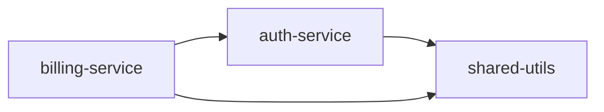

# Monorepo Handling Design for Chronicler

**Date:** 2026-01-23
**Status:** Proposed
**Author:** Claude + User

## Summary

Generate one `.tech.md` per service/package in monorepos. Detection uses manifest-first (lerna, pnpm, nx) with convention-based fallback.

## Decisions Made

| Decision | Rationale |
|----------|-----------|
| One .tech.md per package | Granular documentation, matches enterprise structure |
| Manifest-first detection | Explicit > implicit, respects repo's own config |
| Convention fallback | Works even without workspace config |
| Index file | Machine-readable registry of all packages |

## Detection Strategy

**Priority order:**
1. Parse workspace manifests (lerna.json, pnpm-workspace.yaml, nx.json, rush.json)
2. Fall back to convention directories (packages/, apps/, services/, libs/)
3. Look for package indicators (package.json, pyproject.toml, go.mod)

## Implementation

```python
from dataclasses import dataclass

@dataclass
class DetectedPackage:
    name: str
    path: str              # relative to repo root
    type: str              # "npm" | "python" | "go" | "unknown"
    manifest_file: str | None

class MonorepoDetector:
    WORKSPACE_MANIFESTS = {
        "lerna.json": "lerna",
        "pnpm-workspace.yaml": "pnpm",
        "nx.json": "nx",
        "rush.json": "rush",
    }

    PACKAGE_DIRS = ["packages", "apps", "services", "libs", "modules"]
    PACKAGE_INDICATORS = ["package.json", "pyproject.toml", "go.mod", "Cargo.toml"]

    def detect(self, file_tree: list[str]) -> list[DetectedPackage]:
        # Try manifest-based first
        for manifest in self.WORKSPACE_MANIFESTS:
            if manifest in file_tree:
                packages = self._parse_workspace_manifest(manifest, file_tree)
                if packages:
                    return packages

        # Fall back to convention
        return self._scan_convention_dirs(file_tree)

    def _parse_workspace_manifest(self, manifest: str, file_tree: list[str]) -> list[DetectedPackage]:
        """Parse lerna.json, pnpm-workspace.yaml, etc."""
        # Implementation varies by manifest type
        ...

    def _scan_convention_dirs(self, file_tree: list[str]) -> list[DetectedPackage]:
        """Scan packages/, apps/, services/ for package indicators."""
        packages = []
        for dir_name in self.PACKAGE_DIRS:
            for path in file_tree:
                if path.startswith(f"{dir_name}/"):
                    for indicator in self.PACKAGE_INDICATORS:
                        if path.endswith(indicator):
                            pkg_path = "/".join(path.split("/")[:-1])
                            packages.append(DetectedPackage(
                                name=pkg_path.split("/")[-1],
                                path=pkg_path,
                                type=self._infer_type(indicator),
                                manifest_file=path
                            ))
        return packages
```

## Document Structure

### Directory Layout

```
my-monorepo/
├── .chronicler/
│   ├── my-monorepo.root.tech.md      # Root overview
│   ├── packages/
│   │   ├── auth-service.api.tech.md
│   │   ├── billing-service.api.tech.md
│   │   └── shared-utils.logic.tech.md
│   └── _index.yaml                    # Package registry
```

### _index.yaml (auto-generated)

```yaml
monorepo: true
root_doc: my-monorepo.root.tech.md
packages:
  - name: auth-service
    path: packages/auth
    doc: packages/auth-service.api.tech.md
    type: npm
  - name: billing-service
    path: packages/billing
    doc: packages/billing-service.api.tech.md
    type: npm
  - name: shared-utils
    path: packages/shared
    doc: packages/shared-utils.logic.tech.md
    type: npm
```

### Root .tech.md

Contains:
- High-level architecture overview
- Cross-package dependency graph (Mermaid)
- Links to package docs via `satellite_docs`

```yaml
---
component_id: "my-monorepo"
version: "1.0.0"
layer: "logic"
governance:
  verification_status: "ai_draft"
  visibility: "internal"
satellite_docs:
  packages:
    - "packages/auth-service.api.tech.md"
    - "packages/billing-service.api.tech.md"
---
```

### Package .tech.md

Contains:
- Package-specific metadata
- Internal dependencies via `edges`

```yaml
---
component_id: "auth-service"
version: "2.1.0"
layer: "api"
edges:
  - target: "agent://my-monorepo/packages/shared-utils"
    relationship: "DEPENDS_ON"
---
```

## Cross-Package References

Packages reference siblings using the URI pattern:
```
agent://<repo-name>/packages/<package-name>
```

The root Mermaid graph shows all inter-package dependencies:



## Future Work

- Support Bazel, Gradle, Maven multi-module
- Detect circular dependencies
- Package-level tech debt scoring
