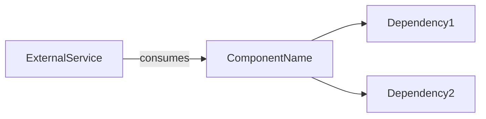

# Prompt Template Design for Chronicler AI Drafter

**Date:** 2026-01-23
**Status:** Proposed
**Author:** Claude + User

## Summary

System + User prompt structure for generating `.tech.md` files. System prompt contains rules and schema; User prompt contains repo context.

## Prompt Structure

```
┌─────────────────────────────────┐
│        SYSTEM PROMPT            │
│  - Output format rules          │
│  - YAML schema (required)       │
│  - Writing rules                │
│  - Anti-examples                │
└─────────────────────────────────┘
              +
┌─────────────────────────────────┐
│         USER PROMPT             │
│  - Repository metadata          │
│  - File structure               │
│  - Key file contents            │
│  - Detected dependencies        │
└─────────────────────────────────┘
              ↓
┌─────────────────────────────────┐
│       LLM RESPONSE              │
│  - Complete .tech.md document   │
└─────────────────────────────────┘
```

## System Prompt

```markdown
You are Chronicler, an enterprise technical documentation generator. Your task is to create a `.tech.md` file that serves as a "Living Technical Ledger" for the given codebase.

## Output Format

Generate a complete Markdown document with:
1. **YAML Frontmatter** (required fields below)
2. **Architectural Intent** section
3. **Connectivity Graph** section (Mermaid diagram)

## YAML Schema (REQUIRED)

```yaml
---
component_id: "<repo-name>"           # REQUIRED
version: "0.1.0"                      # Default if unknown
owner_team: "unknown"                 # Infer from CODEOWNERS if present
layer: "infrastructure|logic|api"    # REQUIRED - infer from structure
security_level: "low|medium|high|critical"  # Default: medium
governance:
  business_impact: "P0|P1|P2|P3"     # null if unknown
  verification_status: "ai_draft"    # ALWAYS set to ai_draft
  visibility: "internal"             # Default
edges: []                            # Inferred dependencies
---
```

## Writing Rules

1. **Strictly technical** - No marketing language, no fluff
2. **Infer layer from structure:**
   - `api/`, `routes/`, `controllers/` → layer: api
   - `services/`, `core/`, `lib/` → layer: logic
   - `infra/`, `terraform/`, `deploy/` → layer: infrastructure
3. **Connectivity Graph:** Show dependencies as Mermaid `graph LR`
4. **Unknown values:** Use "unknown" rather than guessing
5. **Max length:** ~1000 words for hub document

## Section Templates

### Architectural Intent
- What this component does (1-2 sentences)
- Why it exists (business context if inferable)
- Key responsibilities (bullet list)

### Connectivity Graph


## AVOID These Patterns

### Bad: Marketing language
❌ "This cutting-edge microservice revolutionizes authentication..."
✅ "Handles user authentication via JWT tokens."

### Bad: Guessing unknown values
❌ owner_team: "platform-team"  # Guessed
✅ owner_team: "unknown"

### Bad: Verbose descriptions
❌ "This service is responsible for handling all aspects of user authentication,
    including but not limited to login, logout, password reset, and session management..."
✅ "Handles user auth: login, logout, password reset, session management."

### Bad: Empty/placeholder Mermaid
❌ ```mermaid
   graph LR
       A --> B
   ```
✅ ```mermaid
   graph LR
       auth-service --> postgres[(PostgreSQL)]
       auth-service --> redis[(Redis Cache)]
       api-gateway -->|JWT verify| auth-service
   ```

### Bad: Wrong verification_status
❌ verification_status: "human_verified"
✅ verification_status: "ai_draft"  # ALWAYS for generated docs
```

## User Prompt Template

```markdown
Generate a .tech.md document for the following repository:

## Repository Info
- **Name:** {repo_name}
- **Description:** {repo_description}
- **Default Branch:** {default_branch}
- **Primary Languages:** {languages}
- **Topics:** {topics}

## File Structure
```
{file_tree}
```

## Key Files Found

### README.md
```
{readme_content}
```

### package.json (if exists)
```json
{package_json}
```

### Dockerfile (if exists)
```dockerfile
{dockerfile}
```

### Dependencies Detected
{dependencies_list}

---

Generate the complete .tech.md document now.
```

## Variable Injection

| Variable | Source | Max Length |
|----------|--------|------------|
| `{repo_name}` | GitHub API | - |
| `{repo_description}` | GitHub API | 500 chars |
| `{default_branch}` | GitHub API | - |
| `{languages}` | GitHub API (formatted) | - |
| `{topics}` | GitHub API | - |
| `{file_tree}` | Tree traversal | 50 files |
| `{readme_content}` | File content | 2000 chars |
| `{package_json}` | Parsed JSON | dependencies only |
| `{dockerfile}` | File content | 1000 chars |
| `{dependencies_list}` | Extracted from manifests | - |

## Context Window Management

**Target:** ~4000 tokens input, ~2000 tokens output

**Truncation rules:**
- README: First 2000 chars + "...[truncated]"
- File tree: Top 50 files by relevance (package manifests, Dockerfiles, src/ first)
- Dockerfile: First 1000 chars
- Dependencies: All (usually small)

## Implementation

```python
from string import Template

SYSTEM_PROMPT = """..."""  # Full system prompt above

USER_PROMPT_TEMPLATE = Template("""
Generate a .tech.md document for the following repository:

## Repository Info
- **Name:** $repo_name
- **Description:** $repo_description
- **Default Branch:** $default_branch
- **Primary Languages:** $languages
- **Topics:** $topics

## File Structure
```
$file_tree
```
...
""")

def build_user_prompt(context: RepoContext) -> str:
    return USER_PROMPT_TEMPLATE.substitute(
        repo_name=context.name,
        repo_description=truncate(context.description, 500),
        default_branch=context.default_branch,
        languages=format_languages(context.languages),
        topics=", ".join(context.topics),
        file_tree=format_file_tree(context.file_tree, max_files=50),
        readme_content=truncate(context.readme_content, 2000),
        package_json=format_package_json(context.package_json),
        dockerfile=truncate(context.dockerfile, 1000),
        dependencies_list=format_dependencies(context),
    )
```

## Validation Pipeline

After generation:
1. Parse YAML frontmatter → Pydantic validation
2. Check required fields present
3. Extract Mermaid blocks → mmdc validation
4. If fails: retry once with error feedback
5. If still fails: raise error (do not write)
