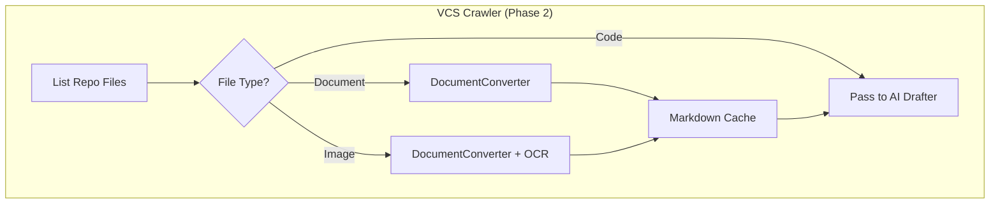

# Document Conversion Design

## Overview

Integrate Microsoft MarkItDown into Chronicler's VCS Crawler to convert enterprise documents (PDF, DOCX, PPTX, images) to markdown for LLM analysis.

## Rationale

Enterprises have existing technical documentation in various formats:
- Architecture docs in PDF/DOCX
- Design presentations in PPTX
- Diagrams as PNG/JPG
- Data exports in XLSX

Chronicler needs this content as markdown to:
1. Include in LLM context when generating `.tech.md`
2. Extract architectural intent from existing docs
3. OCR architecture diagrams for graph generation

## MarkItDown Integration

### Library

**Source:** https://github.com/microsoft/markitdown
**License:** MIT
**Maintainer:** Microsoft

### Supported Formats

| Format | Use Case | Dependencies |
|--------|----------|--------------|
| PDF | Architecture docs, RFCs | pdfminer.six, pdfplumber |
| DOCX | Design docs, specs | mammoth |
| PPTX | Architecture decks | python-pptx |
| XLSX | Data dictionaries | pandas, openpyxl |
| Images | Architecture diagrams | magika (OCR) |
| HTML | Wiki exports | beautifulsoup4 |

### API

```python
from markitdown import MarkItDown

class DocumentConverter:
    def __init__(self, llm_client=None):
        # Optional LLM for image captioning
        self.md = MarkItDown(llm_client=llm_client)

    def convert(self, file_path: str) -> str:
        """Convert document to markdown."""
        result = self.md.convert(file_path)
        return result.text_content

    def convert_stream(self, stream, filename: str) -> str:
        """Convert from file-like object."""
        result = self.md.convert_stream(stream, file_extension=Path(filename).suffix)
        return result.text_content
```

## Integration Architecture



## File Detection

### Target Extensions

```python
DOCUMENT_EXTENSIONS = {
    '.pdf': 'pdfminer.six',
    '.docx': 'mammoth',
    '.pptx': 'python-pptx',
    '.xlsx': 'openpyxl',
    '.xls': 'xlrd',
    '.html': 'beautifulsoup4',
}

IMAGE_EXTENSIONS = {
    '.png', '.jpg', '.jpeg', '.gif', '.bmp', '.webp'
}
```

### Detection Logic

```python
def should_convert(file_path: str) -> bool:
    ext = Path(file_path).suffix.lower()
    return ext in DOCUMENT_EXTENSIONS or ext in IMAGE_EXTENSIONS

def get_required_deps(file_path: str) -> list[str]:
    ext = Path(file_path).suffix.lower()
    if ext in DOCUMENT_EXTENSIONS:
        return [DOCUMENT_EXTENSIONS[ext]]
    if ext in IMAGE_EXTENSIONS:
        return ['magika']
    return []
```

## Configuration

### chronicler.yaml

```yaml
document_conversion:
  enabled: true

  # Which formats to convert
  formats:
    pdf: true
    docx: true
    pptx: true
    xlsx: false  # Skip spreadsheets by default
    images: true

  # OCR settings
  ocr:
    enabled: true
    # Use LLM for image captioning (requires llm config)
    use_llm: false

  # Azure Document Intelligence (optional, for complex PDFs)
  azure_docintel:
    enabled: false
    endpoint: ${AZURE_DOCINTEL_ENDPOINT}

  # Size limits
  max_file_size_mb: 50
  max_pages: 100

  # Caching
  cache:
    enabled: true
    directory: .chronicler/doc_cache
    ttl_days: 7
```

## Caching Strategy

Converted documents cached to avoid re-processing:

```
.chronicler/
├── doc_cache/
│   ├── <sha256_hash>.md          # Converted content
│   └── manifest.json             # Hash → source file mapping
```

### Manifest Schema

```json
{
  "version": 1,
  "entries": {
    "a1b2c3d4...": {
      "source": "docs/architecture.pdf",
      "converted_at": "2026-02-02T10:00:00Z",
      "size_bytes": 12345,
      "format": "pdf"
    }
  }
}
```

## Error Handling

| Error | Action |
|-------|--------|
| Missing dependency | Log warning, skip file, continue |
| Conversion failure | Log error, skip file, continue |
| File too large | Skip with warning |
| Unsupported format | Skip silently |
| OCR failure | Fall back to filename-only metadata |

## Dependencies

### pyproject.toml additions

```toml
[project.optional-dependencies]
docs = [
    "markitdown[pdf,docx,pptx,xlsx]>=0.1.0",
]
docs-azure = [
    "markitdown[azure]>=0.1.0",
]
```

### Install patterns

```bash
# Minimal (no doc conversion)
pip install chronicler

# With document conversion
pip install chronicler[docs]

# Enterprise (Azure DocIntel)
pip install chronicler[docs,docs-azure]
```

## CLI Integration

```bash
# Convert single document (for testing)
chronicler convert docs/architecture.pdf

# Crawl with document conversion
chronicler crawl --include-docs

# Skip documents
chronicler crawl --no-docs
```

## Phase 2 Implementation Steps

1. Add `markitdown` to optional dependencies
2. Create `DocumentConverter` class wrapping MarkItDown
3. Extend `TreeTraversal` to detect document files
4. Add caching layer for converted content
5. Update `crawl` command with `--include-docs` flag
6. Add config section for document conversion settings

## Testing

```python
def test_pdf_conversion():
    converter = DocumentConverter()
    result = converter.convert("tests/fixtures/sample.pdf")
    assert "# " in result  # Has markdown headings
    assert len(result) > 100

def test_image_ocr():
    converter = DocumentConverter()
    result = converter.convert("tests/fixtures/diagram.png")
    # Should extract text or return image metadata
    assert result is not None

def test_missing_dependency():
    # Uninstall pdfminer
    converter = DocumentConverter()
    # Should skip gracefully, not crash
    result = converter.convert("tests/fixtures/sample.pdf")
    assert result is None or "dependency" in result.lower()
```

## Security Considerations

- **File size limits:** Prevent DoS via huge files
- **Sandbox execution:** MarkItDown uses defusedxml for XML parsing
- **No arbitrary code:** PDF/DOCX parsing doesn't execute embedded code
- **Azure credentials:** Use env vars, never store in config files
