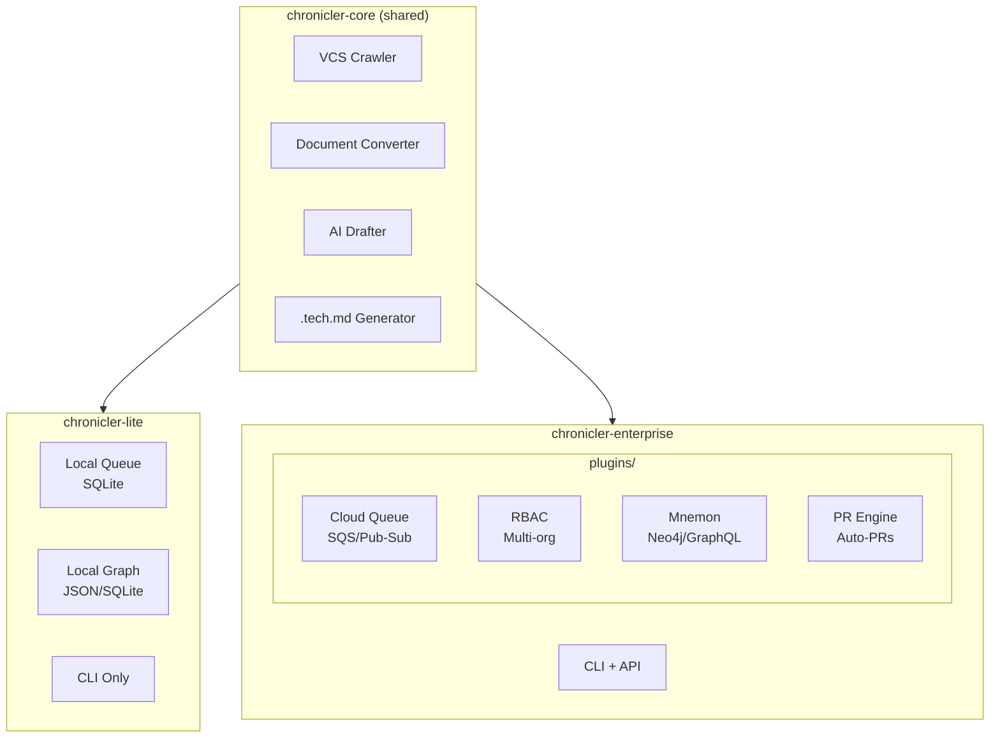

# Product Architecture Design: Chronicler Lite vs Enterprise

## Overview

Split Chronicler into two products sharing a common core:
- **Chronicler Lite** - Personal/indie developers, local-first
- **Chronicler Enterprise** - Organizations, cloud-native, scalable

## Architecture Diagram



## Package Structure

```
chronicler/
├── packages/
│   ├── chronicler-core/           # Shared fundamentals
│   │   ├── src/
│   │   │   ├── vcs/               # GitHub/GitLab/Azure adapters
│   │   │   ├── converter/         # MarkItDown integration
│   │   │   ├── drafter/           # LLM interface
│   │   │   ├── generator/         # .tech.md output
│   │   │   └── interfaces/        # Plugin contracts
│   │   └── pyproject.toml
│   │
│   ├── chronicler-lite/           # Personal/indie product
│   │   ├── src/
│   │   │   ├── queue/             # SQLite-backed local queue
│   │   │   ├── graph/             # File-based linking
│   │   │   └── cli.py             # CLI entry point
│   │   └── pyproject.toml         # deps: chronicler-core
│   │
│   └── chronicler-enterprise/     # Enterprise product
│       ├── src/
│       │   ├── cli.py
│       │   └── api/               # REST/GraphQL server
│       ├── plugins/
│       │   ├── cloud-queue/       # SQS, Pub/Sub, Service Bus
│       │   ├── rbac/              # Multi-org, visibility
│       │   ├── mnemon/            # Neo4j, GraphQL
│       │   └── pr-engine/         # Auto-create PRs
│       └── pyproject.toml
│
└── pyproject.toml                 # Workspace root (uv/poetry)
```

## Feature Comparison

| Feature | Lite | Enterprise |
|---------|------|------------|
| VCS Crawling | ✅ GitHub/GitLab | ✅ + Azure/Bitbucket |
| Document Conversion | ✅ MarkItDown | ✅ + Azure DocIntel |
| AI Drafter | ✅ Claude/GPT | ✅ Same |
| .tech.md Generation | ✅ Full | ✅ Full |
| Queue | SQLite (local) | SQS/Pub-Sub/Service Bus |
| Graph/Linking | JSON files | Neo4j + GraphQL |
| Multi-org/RBAC | ❌ | ✅ |
| Visibility Scopes | ❌ | ✅ (internal/confidential/secret) |
| PR Automation | ❌ | ✅ |
| Mnemon 3D Viz | ❌ | ✅ |
| Max Repos | ~50 | 500+ |
| Install | `pip install chronicler-lite` | `pip install chronicler[enterprise]` |

## Plugin Interface

```python
# chronicler-core/src/interfaces/plugin.py

from abc import ABC, abstractmethod
from typing import Protocol

class QueuePlugin(Protocol):
    """Interface for queue implementations."""

    def enqueue(self, job: Job) -> str:
        """Add job to queue, return job ID."""
        ...

    def dequeue(self) -> Job | None:
        """Get next job from queue."""
        ...

    def ack(self, job_id: str) -> None:
        """Acknowledge job completion."""
        ...

class GraphPlugin(Protocol):
    """Interface for graph/linking implementations."""

    def add_node(self, node: TechDoc) -> None:
        """Add .tech.md to graph."""
        ...

    def add_edge(self, source: str, target: str, relationship: str) -> None:
        """Link two documents."""
        ...

    def query(self, cypher: str) -> list[dict]:
        """Query graph (Cypher-like syntax)."""
        ...

class RBACPlugin(Protocol):
    """Interface for access control."""

    def can_read(self, user: str, doc: str) -> bool:
        ...

    def can_write(self, user: str, doc: str) -> bool:
        ...
```

## Lite Implementation

### Local Queue (SQLite)

```python
# chronicler-lite/src/queue/sqlite_queue.py

import sqlite3
from chronicler_core.interfaces import QueuePlugin

class SQLiteQueue(QueuePlugin):
    def __init__(self, db_path: str = ".chronicler/queue.db"):
        self.conn = sqlite3.connect(db_path)
        self._init_schema()

    def enqueue(self, job: Job) -> str:
        cursor = self.conn.execute(
            "INSERT INTO jobs (payload, status) VALUES (?, ?)",
            (job.to_json(), "pending")
        )
        return str(cursor.lastrowid)

    def dequeue(self) -> Job | None:
        row = self.conn.execute(
            "SELECT id, payload FROM jobs WHERE status = 'pending' LIMIT 1"
        ).fetchone()
        if row:
            self.conn.execute("UPDATE jobs SET status = 'processing' WHERE id = ?", (row[0],))
            return Job.from_json(row[1])
        return None
```

### Local Graph (JSON)

```python
# chronicler-lite/src/graph/json_graph.py

import json
from pathlib import Path
from chronicler_core.interfaces import GraphPlugin

class JSONGraph(GraphPlugin):
    def __init__(self, path: str = ".chronicler/graph.json"):
        self.path = Path(path)
        self.data = self._load()

    def add_node(self, node: TechDoc) -> None:
        self.data["nodes"][node.component_id] = node.to_dict()
        self._save()

    def add_edge(self, source: str, target: str, relationship: str) -> None:
        self.data["edges"].append({
            "source": source,
            "target": target,
            "relationship": relationship
        })
        self._save()

    def query(self, pattern: str) -> list[dict]:
        # Simple pattern matching (not full Cypher)
        # e.g., "CONNECTED_TO:auth-service"
        results = []
        for edge in self.data["edges"]:
            if pattern in f"{edge['relationship']}:{edge['target']}":
                results.append(edge)
        return results
```

## Enterprise Plugin: Cloud Queue

```python
# chronicler-enterprise/plugins/cloud-queue/sqs.py

import boto3
from chronicler_core.interfaces import QueuePlugin

class SQSQueue(QueuePlugin):
    def __init__(self, queue_url: str):
        self.sqs = boto3.client('sqs')
        self.queue_url = queue_url

    def enqueue(self, job: Job) -> str:
        response = self.sqs.send_message(
            QueueUrl=self.queue_url,
            MessageBody=job.to_json()
        )
        return response['MessageId']

    def dequeue(self) -> Job | None:
        response = self.sqs.receive_message(
            QueueUrl=self.queue_url,
            MaxNumberOfMessages=1
        )
        if 'Messages' in response:
            msg = response['Messages'][0]
            return Job.from_json(msg['Body'])
        return None
```

## Configuration

### chronicler-lite: chronicler.yaml

```yaml
# Minimal config for personal use
product: lite

vcs:
  provider: github
  token: ${GITHUB_TOKEN}

llm:
  provider: anthropic
  model: claude-sonnet-4-20250514
  api_key: ${ANTHROPIC_API_KEY}

# Local-only, no cloud deps
queue:
  type: sqlite
  path: .chronicler/queue.db

graph:
  type: json
  path: .chronicler/graph.json
```

### chronicler-enterprise: chronicler.yaml

```yaml
product: enterprise

vcs:
  provider: github
  token: ${GITHUB_TOKEN}

llm:
  provider: anthropic
  model: claude-sonnet-4-20250514
  api_key: ${ANTHROPIC_API_KEY}

# Cloud queue
queue:
  type: sqs
  url: ${AWS_SQS_QUEUE_URL}
  region: us-east-1

# Neo4j graph
graph:
  type: neo4j
  uri: ${NEO4J_URI}
  user: ${NEO4J_USER}
  password: ${NEO4J_PASSWORD}

# Enterprise features
plugins:
  rbac:
    enabled: true
    provider: okta
  mnemon:
    enabled: true
    graphql_port: 4000
  pr_engine:
    enabled: true
    auto_create: false  # Require approval
```

## Upgrade Path: Lite → Enterprise

```bash
# Start with Lite
pip install chronicler-lite
chronicler init
chronicler crawl myorg/myrepo

# Later, upgrade to Enterprise
pip install chronicler-enterprise
# Edit chronicler.yaml to add cloud queue, Neo4j, etc.
chronicler migrate --from-lite
```

## Implementation Phases

### Shared Core (Phase 1-4 current)
Already planned - VCS Crawler, Doc Converter, AI Drafter, Output

### Chronicler Lite (New Phase 5)
- Extract core into `chronicler-core` package
- Implement SQLite queue
- Implement JSON graph
- CLI wrapper
- `pip install chronicler-lite`

### Chronicler Enterprise (Phase 6+)
- Plugin loader system
- Cloud queue plugins (SQS, Pub/Sub, Service Bus)
- RBAC plugin
- Mnemon/Neo4j plugin
- PR Engine plugin

## Testing Strategy

```python
# Test both products against same interface
@pytest.fixture(params=["sqlite", "sqs"])
def queue(request):
    if request.param == "sqlite":
        return SQLiteQueue(":memory:")
    else:
        return SQSQueue(os.environ["TEST_SQS_URL"])

def test_queue_roundtrip(queue):
    job = Job(type="crawl", payload={"repo": "test/repo"})
    job_id = queue.enqueue(job)
    retrieved = queue.dequeue()
    assert retrieved.payload == job.payload
```
