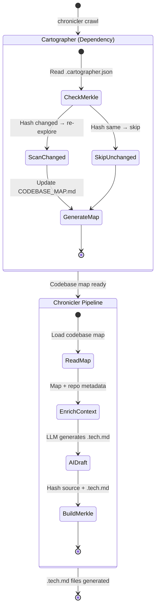

# Cartographer Integration & Merkle Tree Design

> Date: 2026-02-05
> Status: Draft
> Depends on: Enhanced Cartographer standalone plugin, Product Architecture (Lite/Enterprise)

## Goal

Integrate the enhanced Cartographer plugin as a core dependency of Chronicler for codebase mapping, and implement a Merkle tree for drift detection (Lite) + change propagation/blast radius (Enterprise).

## Cartographer Integration

### How It Works

Chronicler calls the enhanced Cartographer plugin as an **automatic dependency**:

1. **Bootstrap**: When `chronicler crawl` runs on a new repo, Chronicler first calls Cartographer to generate a codebase map
2. **AI Drafter context**: The codebase map (`CODEBASE_MAP.md` + `.cartographer.json`) feeds into the AI Drafter as rich context — the LLM gets a pre-digested understanding of architecture, file purposes, and dependencies
3. **Continuous**: When source code changes, Cartographer re-runs (using its own Merkle tree for O(1) change detection), and Chronicler uses the updated map to refresh affected `.tech.md` files

### Architecture



### Dependency Model

```
chronicler-lite
  ├── chronicler-core
  │     ├── vcs-crawler
  │     ├── ai-drafter
  │     └── doc-converter (MarkItDown)
  ├── cartographer-plugin (enhanced, standalone)  ← AUTO-CALLED
  ├── memvid (.mv2 storage)
  └── merkle-tree (drift + propagation)
```

- Chronicler checks if Cartographer plugin is installed
- If not installed: `chronicler crawl` auto-installs it (pip dependency or plugin install)
- If installed: calls Cartographer's API directly
- End user doesn't need to know about Cartographer — it's transparent

### Cartographer → AI Drafter Context

The codebase map provides:

| Map Data | AI Drafter Uses It For |
|----------|----------------------|
| File purposes | Accurate "Architectural Intent" section |
| Dependency graph | Populating `edges` in YAML frontmatter |
| Architecture layers | Correct `layer` classification (infra/logic/api) |
| File relationships | Generating [[wiki-links]] between .tech.md files |
| Entry points | Identifying key components to document first |
| Naming conventions | Matching component_id to project patterns |

**Without Cartographer**: AI Drafter has to infer architecture from raw file listing + content scanning (slow, less accurate)

**With Cartographer**: AI Drafter gets a structured map — dramatically better `.tech.md` quality with fewer LLM tokens

## Merkle Tree Design

### Core Concept

A Merkle tree where each leaf is a hash of (source code + its `.tech.md`). Interior nodes are hashes of their children. This gives us:

- **O(1) staleness check**: Compare root hash to last known good hash
- **O(log n) change localization**: Walk down tree to find exactly which docs are stale
- **O(affected) blast radius**: Walk up from changed node to find all impacted parents

### Data Structure

```
.chronicler/
  .merkle.json              ← Merkle tree state
  auth-service.api.tech.md
  db-connector.util.tech.md
  ...
```

```json
// .merkle.json
{
  "version": 1,
  "root_hash": "abc123...",
  "algorithm": "sha256",
  "nodes": {
    "/": {
      "hash": "abc123...",
      "children": ["src/", "lib/", "services/"]
    },
    "src/": {
      "hash": "def456...",
      "children": ["src/auth/", "src/api/"]
    },
    "src/auth/": {
      "hash": "ghi789...",
      "children": ["src/auth/login.ts", "src/auth/session.ts"]
    },
    "src/auth/login.ts": {
      "hash": "jkl012...",
      "source_hash": "mno345...",     // hash of login.ts source
      "doc_hash": "pqr678...",         // hash of auth-service.api.tech.md
      "doc_path": ".chronicler/auth-service.api.tech.md",
      "stale": false
    }
  },
  "last_scan": "2026-02-05T10:30:00Z"
}
```

### Tier 1: Drift Detection (Lite)

**Purpose**: Know instantly which `.tech.md` files are stale.

**Algorithm**:
1. On `chronicler check` or CI hook: compute current `source_hash` for each tracked file
2. Compare to stored `source_hash` in `.merkle.json`
3. If source changed but `doc_hash` unchanged → **STALE** doc
4. Walk up tree: if any child is stale, parent directory node is stale
5. Root hash changes → at least one doc needs updating

**Output**:
```
$ chronicler check
Merkle root: abc123... → def456... (CHANGED)

Stale documents (3):
  ✗ auth-service.api.tech.md  (login.ts changed 2h ago)
  ✗ db-connector.util.tech.md (schema.sql changed 1d ago)
  ✗ api-gateway.tech.md       (routes.ts changed 3h ago)

Up to date (12):
  ✓ payment-service.tech.md
  ✓ user-service.tech.md
  ...

Run 'chronicler draft --stale' to regenerate stale docs.
```

**CI integration** (Drift Validator):
```yaml
# .github/workflows/chronicler.yml
- name: Check doc drift
  run: chronicler check --ci --fail-on-stale
```

Fails the build if any `.tech.md` is stale — the "Drift Validator" from Phase 2.

### Tier 2: Change Propagation / Blast Radius (Enterprise)

**Purpose**: When a service changes, find ALL documentation that might be affected — including docs that *reference* the changed service.

**Algorithm**:
1. Detect changed node via Merkle diff (same as Tier 1)
2. **Walk up**: Find all parent directory nodes affected
3. **Walk edges**: Using the graph (from YAML `edges` + wiki-links), find all `.tech.md` files that reference the changed component
4. **Transitive closure**: Follow edges N levels deep (configurable) to find indirect impacts
5. **Score impact**: weight by edge type (calls > reads > depends_on)

**Output**:
```
$ chronicler blast-radius --changed src/auth/login.ts

Direct impact:
  auth-service.api.tech.md (source changed)

1-hop dependencies (services that call auth-service):
  api-gateway.tech.md         (calls auth-service, may need update)
  user-service.tech.md        (depends_on auth-service)

2-hop dependencies:
  frontend-bff.tech.md        (calls api-gateway → auth-service)

Recommended action:
  chronicler draft --stale --blast-radius 1
```

**GraphQL integration** (Enterprise):
The blast radius data feeds into the GraphQL Indexer, which Mnemon visualizes as a "blast radius" view — highlight the changed node and all affected nodes in the 3D graph.

### Merkle + Cartographer Synergy

Both Cartographer and Chronicler use Merkle trees, but for different purposes:

| Aspect | Cartographer Merkle | Chronicler Merkle |
|--------|-------------------|------------------|
| What's hashed | Source files | Source files + .tech.md |
| Purpose | O(1) change detection for re-exploration | O(1) staleness detection for doc drift |
| Stored in | `.cartographer.json` | `.chronicler/.merkle.json` |
| Granularity | File-level | File + doc pairs |
| Graph awareness | No (file tree only) | Yes (edges/wiki-links for blast radius) |

**Flow**: Cartographer's Merkle detects source changes → triggers Chronicler's Merkle to check if docs are stale → if stale, triggers AI Drafter re-generation.

## Implementation

### Data Types

```python
@dataclass
class MerkleNode:
    path: str
    hash: str
    children: list[str]      # child paths (directory nodes)
    source_hash: str | None  # leaf nodes only
    doc_hash: str | None     # leaf nodes only
    doc_path: str | None     # leaf nodes only
    stale: bool = False

@dataclass
class MerkleTree:
    version: int
    root_hash: str
    algorithm: str           # sha256
    nodes: dict[str, MerkleNode]
    last_scan: datetime

    def check_drift(self) -> list[MerkleNode]: ...
    def blast_radius(self, changed: str, depth: int = 2) -> list[str]: ...
    def update(self, path: str, source_hash: str) -> None: ...
```

### CLI Commands

| Command | Description |
|---------|-------------|
| `chronicler check` | Check drift status (Merkle comparison) |
| `chronicler check --ci --fail-on-stale` | CI mode: exit 1 if any stale docs |
| `chronicler draft --stale` | Regenerate only stale .tech.md files |
| `chronicler blast-radius --changed <file>` | Show impact of a source change |
| `chronicler blast-radius --depth 3` | Increase transitive closure depth |

## Implementation Phases

| Phase | Deliverable | Tier |
|-------|-------------|------|
| 9a | Merkle tree core: build, diff, serialize | Lite |
| 9b | Drift detection: `chronicler check` | Lite |
| 9c | CI integration: `--ci --fail-on-stale` | Lite |
| 9d | Blast radius: edge-aware propagation | Enterprise |
| 9e | GraphQL + Mnemon blast radius view | Enterprise |

## Key Decisions

| Decision | Rationale |
|----------|-----------|
| Cartographer as auto-dependency | End user gets better .tech.md quality transparently |
| Separate Merkle trees | Cartographer tracks source, Chronicler tracks source+docs — different concerns |
| SHA-256 | Industry standard, fast, collision-resistant |
| .merkle.json in .chronicler/ | Alongside .tech.md, git-trackable |
| Configurable blast radius depth | 1-hop for most teams, 2-3 for large orgs |
| Drift = source changed + doc unchanged | Simple, deterministic, no LLM needed for detection |
| Merkle both tiers | Lite gets drift detection, Enterprise extends with graph-aware propagation |
