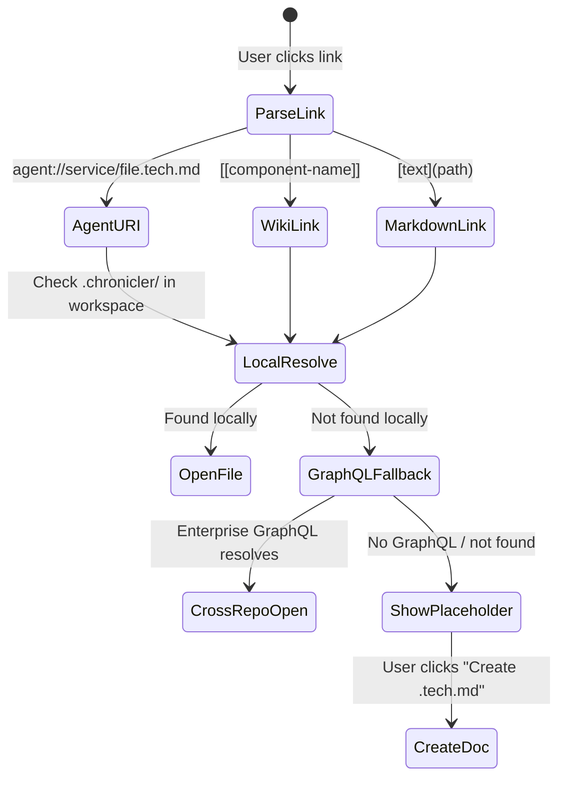

# IDE Integration Design: VS Code Extension

> Date: 2026-02-05
> Status: Draft
> Depends on: Product Architecture (Lite/Enterprise split)

## Goal

Build a VS Code extension ("Chronicler") that makes `.tech.md` files a first-class navigable knowledge base inside the editor. Clickable `agent://` URIs, interactive graph view, backlinks sidebar, and hover previews — inspired by Foam's architecture but purpose-built for Chronicler's `.tech.md` schema.

Because VS Code is the foundation for Cursor, Windsurf, Antigravity (Google), and most AI-native IDEs, this single extension covers the entire modern IDE landscape.

## Research: Foam Architecture (Key Takeaways)

Foam uses a **layered architecture**:
1. **Core** (`src/core/`) — platform-agnostic: workspace, graph, tags, link resolution
2. **Features** (`src/features/`) — VS Code providers: DocumentLinkProvider, DefinitionProvider, HoverProvider, CompletionProvider
3. **Services** (`src/services/`) — bridges core with VS Code APIs (file watching, caching)

**Key VS Code APIs Foam uses:**
| API | Purpose |
|-----|---------|
| `registerDocumentLinkProvider` | Makes `[[wiki-links]]` clickable |
| `registerDefinitionProvider` | F12 / Go to Definition for links |
| `registerReferenceProvider` | Find All References (backlinks) |
| `registerHoverProvider` | Preview target note on hover |
| `registerCompletionItemProvider` | Autocomplete `[[` links |
| `createTreeView` | Sidebar panels (backlinks, tags, orphans) |
| `createWebviewPanel` | Interactive graph visualization |
| `registerDiagnosticCollection` | Warnings for broken links |

**Link resolution**: Reversed trie for efficient identifier matching. Supports `[[note]]`, `[[note#section]]`, `[[note|alias]]`, `![[embed]]`.

**Graph**: WebView-based, receives JSON `{nodeInfo, links}` via `postMessage()`, real-time updates on workspace changes (500ms debounce).

## Architecture

### Extension Structure

```
chronicler-vscode/
  src/
    core/                    # Platform-agnostic (no vscode imports)
      workspace.ts           # Manages all .tech.md resources
      graph.ts               # Dependency/edge graph from YAML edges + wiki-links
      link-resolver.ts       # Resolves agent:// URIs and [[wiki-links]]
      parser.ts              # Parse .tech.md: YAML frontmatter + markdown body
      types.ts               # TechDoc, Edge, Connection types
    features/                # VS Code providers
      link-provider.ts       # DocumentLinkProvider for agent:// and [[links]]
      definition-provider.ts # Go to Definition (F12)
      reference-provider.ts  # Find All References (backlinks)
      hover-provider.ts      # Preview .tech.md on hover
      completion-provider.ts # Autocomplete [[links]] and agent:// URIs
      diagnostics.ts         # Broken link warnings
      graph-panel.ts         # WebView graph visualization
      connections-panel.ts   # TreeView: backlinks + forward links
      tags-panel.ts          # TreeView: tag hierarchy from YAML
    services/
      file-watcher.ts        # Watch .chronicler/ for changes
      graphql-client.ts      # Optional: query enterprise GraphQL indexer
      config.ts              # Extension settings
    extension.ts             # Activation, bootstrap, feature registration
  webview/
    graph/                   # Graph visualization (D3.js or similar)
  package.json               # Extension manifest
```

### Link Resolution Strategy (Hybrid)



**Local resolution** (default):
- `agent://auth-service/api.tech.md` → scan workspace for `.chronicler/auth-service.api.tech.md`
- `[[auth-service]]` → find `.tech.md` with `component_id: auth-service` in YAML frontmatter

**GraphQL fallback** (enterprise):
- Query the Chronicler GraphQL Indexer for cross-repo `.tech.md` location
- Open in new VS Code window or show link to clone

### Data Model

```typescript
interface TechDoc {
  uri: vscode.Uri;
  componentId: string;       // from YAML: component_id
  version: string;           // from YAML: version
  ownerTeam: string;         // from YAML: owner_team
  layer: string;             // infrastructure | logic | api
  securityLevel: string;     // low | medium | high | critical
  edges: Edge[];             // from YAML: edges (dependencies)
  tags: string[];            // from YAML or #hashtags
  title: string;             // first H1 or component_id
  sections: Section[];       // parsed headings
  links: ResourceLink[];     // all outgoing links (agent://, [[]], markdown)
  satellites: string[];      // from YAML: satellite_docs
  properties: Record<string, unknown>; // all YAML frontmatter
}

interface Edge {
  target: string;            // component_id of dependency
  type: string;              // calls | reads | writes | depends_on
  protocol?: string;         // REST | gRPC | SQL | event
}

interface Connection {
  source: vscode.Uri;
  target: vscode.Uri;
  link: ResourceLink;
}
```

### Feature Details

#### 1. DocumentLinkProvider (`link-provider.ts`)

Scans `.tech.md` files for:
- `agent://` URIs → resolve to local file or GraphQL
- `[[wiki-links]]` → resolve by component_id or filename
- Standard markdown links → passthrough

Returns `vscode.DocumentLink` with resolved target URI.

For unresolved links: return link with command URI → triggers "Create .tech.md" flow.

#### 2. Graph Panel (`graph-panel.ts`)

Interactive WebView showing:
- **Nodes**: Each `.tech.md` as a node (color-coded by `layer`)
- **Edges**: From YAML `edges` field + wiki-link references
- **Node size**: By backlink count (more connected = larger)
- **Clustering**: Group by `owner_team` or `layer`
- **Click**: Opens the `.tech.md` file in editor
- **Hover**: Shows component_id, version, security_level

Data source: `graph.ts` core module computes from workspace scan.

#### 3. Connections Panel (`connections-panel.ts`)

TreeView sidebar showing for current `.tech.md`:
```
BACKLINKS (3)
  ├─ api-gateway.tech.md
  │   └─ [line 42] calls agent://auth-service/api.tech.md
  ├─ user-service.tech.md
  │   └─ [line 18] depends_on: auth-service
  └─ frontend.tech.md
      └─ [line 55] [[auth-service]]

FORWARD LINKS (2)
  ├─ db-connector.tech.md (via edges.reads)
  └─ crypto-utils.tech.md (via edges.calls)
```

#### 4. Hover Provider (`hover-provider.ts`)

On hover over `agent://` or `[[link]]`:
- Show first 10 lines of target `.tech.md`
- Show YAML metadata summary (component_id, version, layer)
- Show backlink count
- "Open" button

#### 5. Completion Provider (`completion-provider.ts`)

Triggers on `[[` or `agent://`:
- Lists all known component_ids
- Fuzzy match by component_id, title, tags
- Shows layer icon + version in completion detail
- Inserts correct link syntax

#### 6. Diagnostics (`diagnostics.ts`)

Warnings for:
- Broken `agent://` links (target .tech.md doesn't exist)
- Broken `[[wiki-links]]`
- YAML schema violations (missing required fields)
- Stale version references
- `[FLAG:OUTDATED]` markers

### Configuration

```json
{
  "chronicler.techMdGlob": "**/.chronicler/**/*.tech.md",
  "chronicler.linkResolution": "hybrid",
  "chronicler.graphql.endpoint": "",
  "chronicler.graphql.apiKey": "",
  "chronicler.graph.layout": "force-directed",
  "chronicler.graph.colorBy": "layer",
  "chronicler.graph.groupBy": "owner_team",
  "chronicler.hover.maxLines": 10,
  "chronicler.diagnostics.enable": true,
  "chronicler.wikiLinks.enable": true,
  "chronicler.agentUri.enable": true
}
```

### Wiki-Link Generation (AI Drafter Enhancement)

The AI Drafter (Phase 3) should generate `.tech.md` files with:
1. `agent://` URIs for cross-service references
2. `[[wiki-links]]` for same-repo references
3. Both syntaxes work in VS Code extension AND Obsidian

Example generated output:
```markdown
## Connectivity Graph

This service connects to:
- [[db-connector]] via SQL (reads)
- [[crypto-utils]] via internal API (calls)
- agent://payment-service/api.tech.md via REST (external)
```

## Implementation Phases

| Phase | Deliverable | Effort |
|-------|-------------|--------|
| 7a | VS Code extension scaffold + link provider | Core |
| 7b | Graph panel + connections sidebar | Core |
| 7c | Hover, completion, diagnostics | Polish |
| 7d | GraphQL fallback for cross-repo links | Enterprise |

## Key Decisions

| Decision | Rationale |
|----------|-----------|
| Foam-inspired monolith | Single extension, proven pattern, covers all AI-IDE forks |
| Hybrid link resolution | Local-first for speed, GraphQL fallback for enterprise cross-repo |
| agent:// + [[wiki-links]] dual syntax | agent:// for cross-repo precision, [[]] for in-repo convenience |
| D3.js graph | Industry standard, matches Foam's approach, highly customizable |
| YAML-driven edges | Leverage existing .tech.md schema rather than parsing imports |
| WebView for graph | VS Code's recommended approach for rich visualizations |
