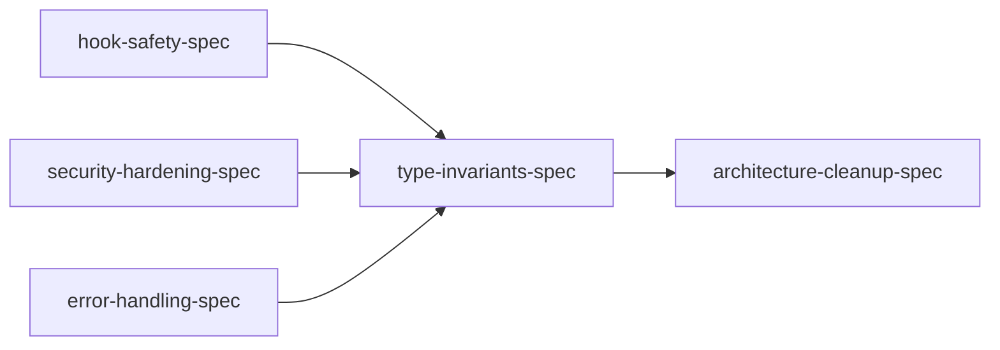

# Chronicler: Code Review Remediation Manifest

**Project:** Chronicler (chronicler-core + chronicler-lite)
**Date:** 2026-02-10
**Mode:** Spec-driven
**Priority:** Quality (proper fixes, real validation, production-ready)
**Source:** Code Review Pro — 5-agent parallel review of 59 files, 4,800 lines

## Context

Chronicler Lite's orchestration specs are feature-complete (6/6 done), but a deep code review found 34 issues across P0-P3 severity. This plan remediates all findings before the product ships.

The review covered: security (path traversal, SSRF, command injection), error handling (LLM adapters, file I/O, hooks), type safety (model invariants, validation), silent failures (hooks, plugins), and architecture (SOLID violations).

## Dependency Graph

Note: A, B, C are independent of each other. D depends on C (error patterns inform validation). E depends on C + D (refactors use new patterns).

## Phase / Sprint / Spec Map

| Phase | Sprint | Spec | Description | Findings | Status |
|-------|--------|------|-------------|----------|--------|
| 1 | 1 | hook-safety-spec | Top-level exception guards + warning logging in all 3 hooks | P0 #1, #2 | pending |
| 1 | 1 | security-hardening-spec | Path traversal, SSRF, command injection, env var leak | P1 #4-7, P2 #18, #24 | pending |
| 1 | 1 | error-handling-spec | LLM error wrapping, file I/O guards, silent failures, config | P1 #8-13, #17, P2 #28 | pending |
| 1 | 2 | type-invariants-spec | Mutable defaults, Field validators, model renames, frontmatter schema | P0 #3, P1 #15-16, P2 #25-27 | pending |
| 2 | 1 | architecture-cleanup-spec | SRP refactors, OCP/ISP fixes, dead code removal | P1 #14, P2 #19-23, #29, P3 #30-34 | pending |

## Spec Files

| Spec | File | Depends On |
|------|------|------------|
| hook-safety-spec | `specs/hook-safety-spec.md` | — |
| security-hardening-spec | `specs/security-hardening-spec.md` | — |
| error-handling-spec | `specs/error-handling-spec.md` | — |
| type-invariants-spec | `specs/type-invariants-spec.md` | error-handling |
| architecture-cleanup-spec | `specs/architecture-cleanup-spec.md` | error-handling, type-invariants |

## Review Finding Cross-Reference

Every finding from the code review is assigned to exactly one spec:

| # | Severity | Title | Spec |
|---|----------|-------|------|
| 1 | P0 | Hooks lack top-level exception guard | hook-safety |
| 2 | P0 | Hook failures completely silent | hook-safety |
| 3 | P0 | Mutable default list in VCSConfig | type-invariants |
| 4 | P1 | Command injection via mercator_path | security-hardening |
| 5 | P1 | Path traversal in output writer | security-hardening |
| 6 | P1 | Path traversal in post_write hook | security-hardening |
| 7 | P1 | SSRF in Ollama adapter | security-hardening |
| 8 | P1 | LLM adapters have no error handling | error-handling |
| 9 | P1 | Ollama streaming JSON parse crash | error-handling |
| 10 | P1 | Scanner manifest parse no error handling | error-handling |
| 11 | P1 | Writer file I/O no error handling | error-handling |
| 12 | P1 | Plugin import failure silent | error-handling |
| 13 | P1 | MemVid YAML parse silent | error-handling |
| 14 | P1 | SRP violation in ContextBuilder | architecture-cleanup |
| 15 | P1 | Empty string IDs allowed in models | type-invariants |
| 16 | P1 | No numeric bounds on config fields | type-invariants |
| 17 | P1 | Config env var silently becomes empty | error-handling |
| 18 | P2 | Config env var expansion leaks secrets | security-hardening |
| 19 | P2 | SRP in MerkleTree | architecture-cleanup |
| 20 | P2 | MerkleTree.build() 99 lines | architecture-cleanup |
| 21 | P2 | OCP in dependency parsing | architecture-cleanup |
| 22 | P2 | ISP in QueuePlugin protocol | architecture-cleanup |
| 23 | P2 | RendererPlugin dead code | architecture-cleanup |
| 24 | P2 | Path traversal in merkle tree | security-hardening |
| 25 | P2 | MerkleNode hash no format validation | type-invariants |
| 26 | P2 | TechDoc.frontmatter is bare dict | type-invariants |
| 27 | P2 | Duplicate LLMConfig names | type-invariants |
| 28 | P2 | Watcher stale set unbounded | error-handling |
| 29 | P2 | Data clumps in drafter | architecture-cleanup |
| 30 | P3 | OCP in auto_detect.py | architecture-cleanup |
| 31 | P3 | Long method in converter.py | architecture-cleanup |
| 32 | P3 | Feature envy in graph.py | architecture-cleanup |
| 33 | P3 | Dataclass mutability | type-invariants |
| 34 | P3 | Missing URL validation | type-invariants |
