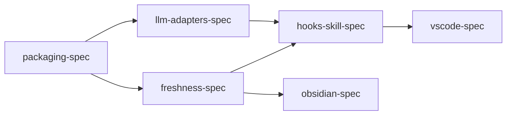

# Chronicler Lite: Distribution & Packaging Manifest

**Project:** Chronicler Lite
**Date:** 2026-02-10
**Mode:** Spec-driven
**Priority:** Quality (polish, docs, error handling — production-ready first impression)

## Vision

Chronicler Lite is ambient documentation for vibe coders. The user calls `/chronicler init` once on an existing project, it generates `.tech.md` files for the entire codebase, and then they never think about it again. Hooks keep docs fresh automatically as they code.

Three consumption channels:
1. **Claude Code** — hooks + skill (ambient generation & freshness)
2. **VS Code** — extension (generation + rich viewing)
3. **Obsidian** — vault sync (graph view, backlinks, mobile reading)

## Product Model

```
chronicler-core     = the engine (crawl, draft, validate, freshness, LLM adapters)
chronicler-lite     = the product for vibe coders (core + hooks + skill + VS Code + Obsidian)
chronicler-enterprise = the product for orgs (core + cloud plugins + RBAC + Neo4j)
```

VS Code extension and Obsidian sync are distribution channels OF Lite, not separate products.

## Repo Strategy

**Development:** Single monorepo (current Chronicler folder).
**Publishing:**
- chronicler-core → PyPI (public, MIT/Apache)
- chronicler-lite → PyPI (public, depends on core)
- chronicler-lite[obsidian] → extra for Obsidian sync daemon
- chronicler-vscode → VS Code Marketplace (TypeScript, calls Python engine)
- chronicler-enterprise → private repo at publish time (depends on core from PyPI)

## Architecture

```
chronicler/                         # Git repo root (monorepo)
├── packages/
│   ├── chronicler-core/            # Engine: crawl, draft, validate, freshness, LLM
│   │   ├── pyproject.toml
│   │   └── src/chronicler_core/
│   ├── chronicler-lite/            # Product: hooks, skill, obsidian sync, CLI
│   │   ├── pyproject.toml          # deps: chronicler-core, [obsidian] extra
│   │   └── src/chronicler_lite/
│   │       ├── hooks/              # Claude Code ambient hooks
│   │       ├── obsidian/           # Vault sync daemon
│   │       └── cli.py
│   ├── chronicler-enterprise/      # Product: cloud plugins, RBAC, Neo4j
│   │   └── ...
│   └── chronicler-vscode/          # VS Code extension (TypeScript)
│       ├── package.json
│       └── src/
├── pyproject.toml                  # Workspace root (uv)
├── skill/chronicler.md             # /chronicler slash command (ships separately)
└── tests/

User's project/
├── .chronicler/                    # Generated .tech.md files
│   ├── .merkle.json                # Staleness manifest
│   └── *.tech.md
└── chronicler.yaml                 # Config (auto-generated on init)

~/.claude/
├── skills/chronicler.md            # Installed by /chronicler init
└── hooks/chronicler/               # Ambient hooks (installed by init)

pip install chronicler-lite         # Gets core + hooks + CLI
pip install chronicler-lite[obsidian]  # Adds obsidian sync
```

## Dependency Graph



## Phase / Sprint / Spec Map

| Phase | Sprint | Spec | Description | Status |
|-------|--------|------|-------------|--------|
| 1 | 1 | packaging-spec | Monorepo restructure, chronicler-core extraction, pip install | completed |
| 1 | 2 | llm-adapters-spec | Multi-LLM provider interface: Claude, OpenAI, Gemini, Ollama | completed |
| 1 | 2 | freshness-spec | File watcher, merkle staleness, auto-regeneration | completed |
| 2 | 1 | hooks-skill-spec | Claude Code hooks (ambient) + /chronicler skill (manual) | completed |
| 2 | 2 | vscode-spec | TypeScript extension: generation + viewing + LLM provider | draft |
| 2 | 2 | obsidian-spec | Sync daemon + vault adapter for graph/Dataview | draft |

## Spec Files

| Spec | File | Depends On |
|------|------|------------|
| packaging-spec | `specs/packaging-spec.md` | — |
| llm-adapters-spec | `specs/llm-adapters-spec.md` | packaging |
| freshness-spec | `specs/freshness-spec.md` | packaging |
| hooks-skill-spec | `specs/hooks-skill-spec.md` | llm-adapters, freshness |
| vscode-spec | `specs/vscode-spec.md` | hooks-skill, freshness |
| obsidian-spec | `specs/obsidian-spec.md` | freshness |
