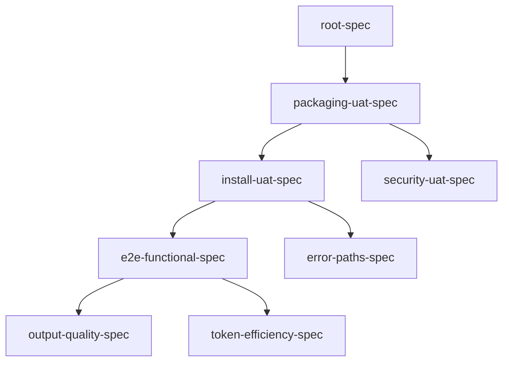

# UAT Manifest: Chronicler Lite End-to-End Testing

**Project:** Chronicler Lite
**Date:** 2026-02-10
**Mode:** Spec-driven
**Priority:** Quality

## Dependency Graph

## Phase / Sprint / Spec Map

| Phase | Sprint | Spec | Description |
|-------|--------|------|-------------|
| 1 | 1 | root-spec | Environment setup, test matrix, tooling |
| 1 | 1 | packaging-uat-spec | Build, dep resolution, distributable |
| 1 | 2 | install-uat-spec | pip, Claude Code CLI, VS Code install paths |
| 1 | 2 | security-uat-spec | Input sanitization, path traversal, env vars |
| 2 | 1 | e2e-functional-spec | Real project runs, codebase map, tech.md |
| 2 | 1 | error-paths-spec | Graceful failures under bad conditions |
| 2 | 2 | output-quality-spec | tech.md depth vs bloat, staleness, freshness |
| 2 | 2 | token-efficiency-spec | API usage measurement, optimization notes |

## Spec Files

| File | Path | Status |
|------|------|--------|
| root-spec.md | uat-specs/root-spec.md | draft |
| packaging-uat-spec.md | uat-specs/packaging-uat-spec.md | draft |
| install-uat-spec.md | uat-specs/install-uat-spec.md | draft |
| security-uat-spec.md | uat-specs/security-uat-spec.md | draft |
| e2e-functional-spec.md | uat-specs/e2e-functional-spec.md | draft |
| error-paths-spec.md | uat-specs/error-paths-spec.md | draft |
| output-quality-spec.md | uat-specs/output-quality-spec.md | draft |
| token-efficiency-spec.md | uat-specs/token-efficiency-spec.md | draft |
