# Task Plan: Chronicler Phase 1 - Orchestrator MVP

## Goal
Build VCS Crawler + AI Drafter to auto-generate `.tech.md` files for GitHub repos.

## Priority
Speed - MVP approach, ship fast, iterate later

## Approach
- **Stack:** Python (better LLM libs, easier scripting)
- **Target VCS:** GitHub first (best API, Octokit/PyGithub mature)
- **Scope:** VCS Crawler + AI Drafter only (defer Metadata Harvester, PR Engine)

## Current Phase
Phase 1.5 (Config System)

## Task Tracking
Progress tracked via native Claude Code tasks (visible in UI):
- ~~**Task #1**: Phase 1: Project Setup~~ ✅ completed
- **Task #2**: Phase 1.5: Config System (blocked by #1)
- **Task #3**: Phase 2a: VCS Crawler (blocked by #2)
- **Task #4**: Phase 2b: Document Converter (blocked by #3)
- **Task #5**: Phase 3: AI Drafter (blocked by #3, #4)
- **Task #6**: Phase 4: Output & Validation (blocked by #5)
- **Task #7**: Phase 4.5: Testing & CI (blocked by #6)

Use `TaskList()` to check status, `TaskUpdate(taskId, status="in_progress/completed")` to update.

## Revised Plan (from orchestration review)

Changes from original plan:
| Change | Reason |
|--------|--------|
| Phase 2 → split 2a/2b | VCS Crawler and Doc Converter are separate concerns |
| Added Phase 1.5: Config System | `chronicler.yaml` + Pydantic validation is foundational |
| Added Phase 4.5: Testing & CI | pytest fixtures + integration tests before major refactor |
| Phases 5-9 flagged for future splitting | Each contains multiple sprints of work |

### MVP Execution Plan (Phases 1–4.5)

| Phase | Title | Tasks | Agent Type | Confidence | Status |
|-------|-------|-------|-----------|------------|--------|
| 1 | Project Setup | 4 | general-purpose | HIGH | ✅ Done |
| 1.5 | Config System | 3 | general-purpose | HIGH | ✅ Done |
| 2a | VCS Crawler | 4 | general-purpose | HIGH | ✅ Done |
| 2b | Document Converter | 3 | general-purpose | MEDIUM | ✅ Done |
| 3 | AI Drafter | 5 | general-purpose | MEDIUM | ✅ Done |
| 4 | Output & Validation | 3 | general-purpose | HIGH | ✅ Done |
| 4.5 | Testing & CI | 3 | general-purpose | HIGH | ✅ Done |

### Post-MVP Phases (deferred, need further decomposition)
- Phase 5a-d: Chronicler Lite (core extraction, SQLite, MemVid, CLI)
- Phase 6a-e: Enterprise plugins (loader, queues, RBAC, Neo4j, PR Engine)
- Phase 7a-d: VS Code Extension (TypeScript)
- Phase 8a-b: Obsidian Integration (Python daemon + TS plugin)
- Phase 9a-c: Cartographer + Merkle (codebase mapping + drift detection + blast radius)

## State Machine

```mermaid
stateDiagram-v2
    [*] --> ProjectSetup: Start

    state "Phase 1: Project Setup" as ProjectSetup {
        [*] --> InitPython
        InitPython --> SetupStructure
        SetupStructure --> AddGitHubClient
        AddGitHubClient --> AddLLMClient
        AddLLMClient --> [*]
    }

    state "Phase 2: VCS Crawler + Doc Converter" as VCSCrawler {
        [*] --> GitHubAuth
        GitHubAuth --> ListRepos
        ListRepos --> FetchMetadata
        FetchMetadata --> TreeTraversal
        TreeTraversal --> DetectDocs
        DetectDocs --> ConvertDocs: PDF/DOCX/images found
        DetectDocs --> [*]: code only
        ConvertDocs --> CacheMarkdown
        CacheMarkdown --> [*]
    }

    state "Phase 3: AI Drafter" as AIDrafter {
        [*] --> DesignPrompt
        DesignPrompt --> ParseContext
        ParseContext --> GenerateYAML
        GenerateYAML --> GenerateIntent
        GenerateIntent --> GenerateGraph
        GenerateGraph --> [*]
    }

    state "Phase 4: Output" as Output {
        [*] --> WriteTechMd
        WriteTechMd --> ValidateSchema
        ValidateSchema --> DryRunMode
        DryRunMode --> [*]
    }

    ProjectSetup --> VCSCrawler: deps installed
    VCSCrawler --> AIDrafter: repo context ready
    AIDrafter --> Output: .tech.md drafted
    Output --> [*]: MVP complete
```

## Phases

### Phase 1: Project Setup ✅
- Init Python project (pyproject.toml, hatchling)
- Setup directory structure
- Add GitHub API client (PyGithub) — provider-agnostic VCS interface
- Add Anthropic/OpenAI client for LLM — provider-agnostic LLM interface

### Phase 1.5: Config System ✅
- Pydantic models for all config sections (LLMConfig, QueueConfig, VCSConfig, OutputConfig, MonorepoConfig, ChroniclerConfig)
- YAML config loader with resolution order (CLI → env → project → user → defaults) + `${VAR}` env expansion
- CLI integration: wire `--config` flag, export public API from `chronicler/config/`
- See: `docs/plans/2026-01-23-config-design.md`

### Phase 2a: VCS Crawler
- GitHub auth (PAT via config)
- List repos for org/user
- Fetch repo metadata (languages, structure)
- Tree traversal (identify key files: package.json, Dockerfile, etc.)

### Phase 2b: Document Converter
- Detect document files (PDF, DOCX, PPTX, images)
- Convert to markdown via MarkItDown
- Extract text from architecture diagrams (OCR)
- Cache converted content for LLM context

### Phase 3: AI Drafter
- Design prompt template for .tech.md generation
- Parse repo context into LLM-friendly format
- Generate YAML frontmatter from harvested metadata
- Generate Architectural Intent section
- Generate Connectivity Graph (infer from imports/deps)

### Phase 4: Output & Validation
- Write .tech.md to `.chronicler/` directory (local)
- Validate YAML schema compliance
- Dry-run mode for testing

### Phase 4.5: Testing & CI
- pytest fixtures for VCS, LLM, and config mocking
- Integration tests (end-to-end crawl → draft → validate)
- CI pipeline setup

### Phase 5: Chronicler Lite (Task #5)
- Extract core into `chronicler-core` package
- Implement SQLite queue (local, no cloud deps)
- **MemVid integration** (replaces JSON graph):
  - Store `.tech.md` in `.mv2` format
  - Hybrid search (lexical + vector + time)
  - Memory Cards for SPO triplets (built-in knowledge graph)
  - `ChroniclerMemory` wrapper class
- CLI wrapper: `chronicler search`, `chronicler deps`
- Package as `pip install chronicler-lite`

### Phase 6: Chronicler Enterprise (Task #6)
- Plugin loader system
- Cloud queue plugins (SQS, Pub/Sub, Service Bus)
- RBAC plugin (multi-org, visibility scopes)
- Mnemon/Neo4j plugin (GraphQL)
- PR Engine plugin (auto-create documentation PRs)

### Phase 7: VS Code Extension (Task #7)
- Extension scaffold (package.json, activation, file watcher)
- **Core**: Workspace scanner, .tech.md parser, link resolver
- **Link Provider**: DocumentLinkProvider for agent:// + [[wiki-links]]
- **Definition Provider**: F12 Go to Definition for links
- **Hover Provider**: Preview .tech.md on hover
- **Completion Provider**: Autocomplete [[links]] and agent:// URIs
- **Diagnostics**: Broken link warnings, YAML schema violations
- **Graph Panel**: WebView with D3.js force-directed graph
- **Connections Panel**: TreeView sidebar (backlinks + forward links)
- **GraphQL Fallback**: Cross-repo link resolution via enterprise indexer

### Phase 8: Obsidian Integration (Task #8)
- **Phase 8a: Sync Daemon**
  - Transform pipeline: link rewriter + frontmatter mapper + Dataview fields
  - `chronicler obsidian export --vault <path>` (one-shot)
  - `chronicler obsidian sync --watch` (file watcher mode)
  - `chronicler obsidian sync --rest` (Local REST API mode)
  - _index.md auto-generation with Dataview queries
- **Phase 8b: Obsidian Community Plugin**
  - agent:// URI handler (markdown post-processor)
  - Dependency Explorer view (custom sidebar leaf)
  - Doc Health Dashboard (verification status, staleness)
  - Graph view enhancements (color by layer, filter by tag)
  - Chronicler commands palette (sync, create, browse)

### Phase 9: Cartographer Integration + Merkle Tree (Task #9)
- **Cartographer as auto-dependency:**
  - Chronicler calls enhanced Cartographer plugin to map codebase first
  - Codebase map feeds into AI Drafter as rich context
  - Auto re-runs on source changes (Cartographer's own Merkle)
- **Merkle Tree (Lite - Drift Detection):**
  - Hash source code + .tech.md pairs in .merkle.json
  - `chronicler check` → O(1) staleness detection
  - `chronicler draft --stale` → regenerate only stale docs
  - CI integration: `--ci --fail-on-stale` fails build on drift
- **Merkle Tree (Enterprise - Blast Radius):**
  - Graph-aware change propagation via edges + wiki-links
  - `chronicler blast-radius --changed <file>` → N-hop impact analysis
  - Feeds into GraphQL Indexer → Mnemon 3D blast radius view

## Key Questions
- ~~LLM model choice? (Claude vs GPT-4 vs local)~~ **RESOLVED** - see LLM design doc
- ~~Rate limiting strategy for GitHub API?~~ **RESOLVED** - see rate limiting design doc
- ~~How to handle monorepos?~~ **RESOLVED** - see monorepo design doc

## Decisions Made
| Decision | Rationale |
|----------|-----------|
| Python stack | Better LLM ecosystem (anthropic SDK), faster iteration |
| GitHub first | Best API, most common, defer Azure/GitLab |
| Skip Metadata Harvester | Can inline into AI Drafter for MVP |
| Skip PR Engine | Manual review first, automate later |
| Provider-agnostic LLM | Enterprise picks provider (Claude/GPT-4/Gemini) via config |
| Custom interface (not LiteLLM) | Lean, controlled, fewer deps |
| Cloud-first, defer local | Faster MVP, add Ollama/vLLM later |
| Streaming generation | Long docs benefit from incremental output |
| Retry at interface level | Consistent behavior across providers |
| Strict validation | Reject invalid output, no partial files |
| Mermaid validation | Ensure connectivity graphs are syntactically valid |
| Queue-based rate limiting | SQS/Pub-Sub/Service Bus, handles 500+ repos |
| Provider-agnostic queue | Same pattern as LLM - enterprise picks provider |
| Dead letter queue | Failed jobs don't block pipeline |
| One .tech.md per package | Granular monorepo documentation |
| Manifest-first detection | Parse lerna/pnpm/nx, fallback to convention dirs |
| _index.yaml registry | Machine-readable package list for monorepos |
| Subcommand CLI (`chronicler`) | `chronicler crawl/draft/validate` - discoverable |
| YAML config (`chronicler.yaml`) | Matches .tech.md format, supports comments |
| System + User prompt | Clean separation of rules vs context |
| Anti-examples in prompt | Prevent common LLM mistakes |
| MarkItDown for doc conversion | Microsoft lib, handles PDF/DOCX/PPTX/images |
| OCR for architecture diagrams | Extract text from images in repos |
| Optional doc conversion deps | Install pdfminer/mammoth only when needed |
| Foam-inspired VS Code ext | Single extension, covers Cursor/Windsurf/Antigravity |
| Hybrid link resolution | Local-first, GraphQL fallback for cross-repo |
| Dual link syntax (agent:// + [[wiki]]) | Cross-repo precision + in-repo convenience |
| Obsidian sync daemon first | Delivers value immediately, plugin builds on synced files |
| Transform pipeline for Obsidian | Link rewriting, frontmatter flattening, Dataview injection |
| Dataview field injection | Turns .tech.md into queryable database in Obsidian |
| Cartographer as auto-dependency | End user gets better .tech.md quality transparently |
| Separate Merkle trees | Cartographer tracks source, Chronicler tracks source+docs |
| Merkle both tiers | Lite = drift detection, Enterprise = blast radius propagation |

## Design Documents
- [LLM Interface Design](docs/plans/2026-01-23-llm-interface-design.md)
- [Rate Limiting Design](docs/plans/2026-01-23-rate-limiting-design.md)
- [Monorepo Design](docs/plans/2026-01-23-monorepo-design.md)
- [CLI Design](docs/plans/2026-01-23-cli-design.md)
- [Config Design](docs/plans/2026-01-23-config-design.md)
- [Prompt Design](docs/plans/2026-01-23-prompt-design.md)
- [Document Conversion Design](docs/plans/2026-02-02-document-conversion-design.md)
- [Product Architecture Design](docs/plans/2026-02-02-product-architecture-design.md) (Lite vs Enterprise)
- [MemVid Integration Design](docs/plans/2026-02-02-memvid-integration-design.md) (.mv2 storage + search)
- [IDE Integration Design](docs/plans/2026-02-05-ide-integration-design.md) (VS Code extension)
- [Obsidian Integration Design](docs/plans/2026-02-05-obsidian-integration-design.md) (Sync daemon + community plugin)
- [Cartographer + Merkle Design](docs/plans/2026-02-05-cartographer-merkle-design.md) (Codebase mapping + drift detection + blast radius)

## Errors Encountered
| Error | Attempt | Resolution |
|-------|---------|------------|
