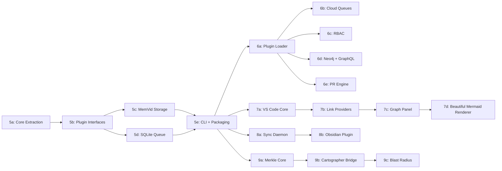

# Task Plan: Chronicler Post-MVP Roadmap (Phases 5–9)

## Goal
Evolve Chronicler from a working MVP (crawl → draft → validate) into a full product suite:
Lite (local-first, MemVid-powered), Enterprise (plugins, RBAC, cloud queues), IDE integrations
(VS Code + Obsidian), and infrastructure (Merkle drift detection, Cartographer).

## Priority
Full roadmap — all phases planned at interface-contract depth.

## Approach
- **Spec-driven:** Each sub-phase defines input/output types and public API before implementation
- **Beautiful Mermaid:** Integrated in IDE/Obsidian layers only (Phase 7d, 8b) — `.tech.md` keeps raw Mermaid syntax
- **MemVid SDK v2:** `pip install memvid-sdk` (v2.0.156, stable, Rust+PyO3)
- **Incremental packaging:** Phase 5a restructures into monorepo, all later phases build on that layout

## Dependency Graph



---

## Phase 5: Chronicler Lite

### Phase 5a: Core Extraction + Monorepo Restructure

**Goal:** Restructure flat `chronicler/` into a monorepo with `chronicler-core` as a shared package.

**Input:** Current flat layout (27 .py files under `chronicler/`)
**Output:** Monorepo with `packages/chronicler-core/` containing VCS, LLM, Converter, Drafter, Output, Config

**Layout after 5a:**
```
chronicler/
├── packages/
│   └── chronicler-core/
│       ├── pyproject.toml
│       └── src/chronicler_core/
│           ├── __init__.py
│           ├── vcs/          (moved from chronicler/vcs/)
│           ├── llm/          (moved from chronicler/llm/)
│           ├── converter/    (moved from chronicler/converter/)
│           ├── drafter/      (moved from chronicler/drafter/)
│           ├── output/       (moved from chronicler/output/)
│           └── config/       (moved from chronicler/config/)
├── pyproject.toml            (workspace root — uv workspaces)
└── tests/                    (stays at root, imports chronicler_core)
```

**Interface contract:**
```python
# chronicler_core/__init__.py — public surface stays identical
from chronicler_core.vcs import VCSProvider, GitHubProvider, VCSCrawler, create_provider
from chronicler_core.llm import LLMProvider, create_llm_provider
from chronicler_core.drafter import Drafter, ContextBuilder
from chronicler_core.output import TechMdWriter, TechMdValidator
from chronicler_core.converter import DocumentConverter
from chronicler_core.config import ChroniclerConfig, load_config
```

**Tasks:**
1. Init uv workspace at root (`pyproject.toml` with `[tool.uv.workspace]`)
2. Move `chronicler/` → `packages/chronicler-core/src/chronicler_core/`
3. Update all internal imports (`chronicler.` → `chronicler_core.`)
4. Fix tests to import from `chronicler_core`
5. Verify 180 tests still pass

**Agent type:** general-purpose
**Confidence:** HIGH (mechanical restructure, no logic changes)

---

### Phase 5b: Plugin Interfaces

**Goal:** Define Protocol classes that Lite and Enterprise plugins implement.

**Input:** Design doc interfaces (QueuePlugin, GraphPlugin, RBACPlugin)
**Output:** `chronicler_core/interfaces/` with typed Protocol definitions

**Interface contract:**
```python
# chronicler_core/interfaces/__init__.py
from chronicler_core.interfaces.queue import QueuePlugin, Job, JobStatus
from chronicler_core.interfaces.graph import GraphPlugin, GraphNode, GraphEdge
from chronicler_core.interfaces.rbac import RBACPlugin, Permission
from chronicler_core.interfaces.storage import StoragePlugin, SearchResult
from chronicler_core.interfaces.renderer import RendererPlugin, RenderFormat

# chronicler_core/interfaces/queue.py
class QueuePlugin(Protocol):
    def enqueue(self, job: Job) -> str: ...
    def dequeue(self) -> Job | None: ...
    def ack(self, job_id: str) -> None: ...
    def nack(self, job_id: str, reason: str) -> None: ...
    def dead_letters(self) -> list[Job]: ...

# chronicler_core/interfaces/graph.py
class GraphPlugin(Protocol):
    def add_node(self, node: GraphNode) -> None: ...
    def add_edge(self, edge: GraphEdge) -> None: ...
    def neighbors(self, node_id: str, depth: int = 1) -> list[GraphNode]: ...
    def query(self, expression: str) -> list[dict]: ...

# chronicler_core/interfaces/storage.py
class StoragePlugin(Protocol):
    def store(self, doc_id: str, content: str, metadata: dict) -> None: ...
    def search(self, query: str, k: int = 10, mode: str = "auto") -> list[SearchResult]: ...
    def get(self, doc_id: str) -> str | None: ...
    def state(self, entity: str) -> dict: ...

# chronicler_core/interfaces/renderer.py
class RendererPlugin(Protocol):
    """Renderer for diagram blocks within .tech.md content."""
    def render(self, source: str, format: RenderFormat) -> str: ...
    def supported_types(self) -> list[str]: ...
```

**Tasks:**
1. Create `chronicler_core/interfaces/` package with Protocol classes
2. Create Pydantic models: Job, JobStatus, GraphNode, GraphEdge, SearchResult, RenderFormat
3. Add type stubs for downstream consumers
4. Unit tests for model serialization

**Agent type:** general-purpose
**Confidence:** HIGH (pure type definitions)

---

### Phase 5c: MemVid Storage Layer

**Goal:** Implement `StoragePlugin` using MemVid SDK v2, replacing any JSON-based graph.

**Input:** `memvid-sdk>=2.0.0`, StoragePlugin protocol from 5b
**Output:** `packages/chronicler-lite/src/chronicler_lite/storage/memvid_storage.py`

**Interface contract:**
```python
# chronicler_lite/storage/memvid_storage.py
from chronicler_core.interfaces import StoragePlugin, SearchResult

class MemVidStorage(StoragePlugin):
    """MemVid .mv2 backed storage with hybrid search and SPO triplets."""

    def __init__(self, path: str = ".chronicler/chronicler.mv2",
                 embedding: str = "bge-small"):
        # Calls Memvid.create() or Memvid.use() depending on existence
        ...

    def store(self, doc_id: str, content: str, metadata: dict) -> None:
        # mem.put(text=content, title=doc_id, label="tech.md", metadata=metadata)
        # Auto-extracts SPO triplets from YAML frontmatter edges
        ...

    def search(self, query: str, k: int = 10, mode: str = "auto") -> list[SearchResult]:
        # mem.find(query, k=k, mode=mode)
        ...

    def get(self, doc_id: str) -> str | None:
        # mem.find(doc_id, k=1, mode="lex") exact match
        ...

    def state(self, entity: str) -> dict:
        # mem.state(entity) — O(1) SPO lookup
        ...

    def enrich_from_frontmatter(self, doc_id: str, edges: list[dict]) -> None:
        # Convert YAML edges to Memory Cards, call mem.add_memory_cards()
        ...

    def rebuild(self, tech_md_dir: str) -> None:
        # Rebuild .mv2 from all .tech.md files (disaster recovery)
        ...
```

**Dependencies:** `memvid-sdk>=2.0.0`

**Tasks:**
1. Add `memvid-sdk` to chronicler-lite deps
2. Implement MemVidStorage class
3. Implement frontmatter → SPO triplet extraction
4. Implement rebuild from .tech.md directory
5. Tests: store/search/state round-trip, rebuild idempotency

**Agent type:** general-purpose
**Confidence:** MEDIUM (external SDK, API assumptions need validation)

---

### Phase 5d: SQLite Queue

**Goal:** Local job queue for batch processing repos without cloud infra.

**Input:** QueuePlugin protocol from 5b
**Output:** `packages/chronicler-lite/src/chronicler_lite/queue/sqlite_queue.py`

**Interface contract:**
```python
class SQLiteQueue(QueuePlugin):
    def __init__(self, db_path: str = ".chronicler/queue.db"): ...
    def enqueue(self, job: Job) -> str: ...
    def dequeue(self) -> Job | None: ...
    def ack(self, job_id: str) -> None: ...
    def nack(self, job_id: str, reason: str) -> None: ...
    def dead_letters(self) -> list[Job]: ...
    def stats(self) -> dict: ...  # pending/processing/completed/dead counts
```

Schema: single `jobs` table with (id, payload_json, status, created_at, updated_at, error).

**Tasks:**
1. Implement SQLiteQueue with WAL mode
2. Add retry logic (max 3 attempts before dead letter)
3. Tests: enqueue/dequeue cycle, dead letter overflow, concurrent safety

**Agent type:** general-purpose
**Confidence:** HIGH (stdlib sqlite3, straightforward)

---

### Phase 5e: Lite CLI + Packaging

**Goal:** Wire MemVid storage + SQLite queue into a `chronicler-lite` package with CLI.

**Input:** MemVidStorage (5c), SQLiteQueue (5d), chronicler-core
**Output:** `pip install chronicler-lite` with `chronicler` CLI

**New CLI commands:**
```
chronicler search <query>     # Hybrid search via MemVid
chronicler deps <component>   # Show dependencies via SPO state()
chronicler queue status       # Show queue stats
chronicler queue run           # Process pending queue jobs
chronicler rebuild             # Rebuild .mv2 from .tech.md files
```

**Package layout:**
```
packages/chronicler-lite/
├── pyproject.toml           # deps: chronicler-core, memvid-sdk
└── src/chronicler_lite/
    ├── __init__.py
    ├── cli.py               # Extended CLI (inherits core commands)
    ├── storage/
    │   ├── __init__.py
    │   └── memvid_storage.py
    └── queue/
        ├── __init__.py
        └── sqlite_queue.py
```

**Tasks:**
1. Create chronicler-lite package structure
2. Wire CLI commands to MemVidStorage and SQLiteQueue
3. Integration test: crawl → draft → store in .mv2 → search
4. Package and verify `pip install -e packages/chronicler-lite`

**Agent type:** general-purpose
**Confidence:** HIGH

---

## Phase 6: Chronicler Enterprise

### Phase 6a: Plugin Loader

**Goal:** Dynamic plugin discovery and loading system.

**Input:** Plugin Protocol interfaces from 5b
**Output:** `chronicler_core/plugins/loader.py`

**Interface contract:**
```python
class PluginLoader:
    """Discovers and loads plugins via entry points or config."""

    def __init__(self, config: ChroniclerConfig): ...

    def discover(self) -> dict[str, list[str]]:
        # Scans entry_points group "chronicler.plugins"
        # Returns {"queue": ["sqs", "pubsub"], "graph": ["neo4j"], ...}
        ...

    def load_queue(self, name: str = None) -> QueuePlugin:
        # name from config or auto-detect
        ...

    def load_graph(self, name: str = None) -> GraphPlugin: ...
    def load_rbac(self, name: str = None) -> RBACPlugin | None: ...
    def load_storage(self, name: str = None) -> StoragePlugin: ...
```

Uses Python `importlib.metadata.entry_points()` for discovery. Plugins register via:
```toml
[project.entry-points."chronicler.plugins.queue"]
sqs = "chronicler_enterprise.plugins.cloud_queue.sqs:SQSQueue"
```

**Tasks:**
1. Implement PluginLoader with entry_points discovery
2. Add config section: `plugins:` with provider names
3. Fallback chain: config → entry_points → Lite defaults
4. Tests: mock entry points, loading, missing plugin errors

**Agent type:** general-purpose
**Confidence:** HIGH

---

### Phase 6b: Cloud Queue Plugins

**Goal:** SQS, Google Pub/Sub, Azure Service Bus queue implementations.

**Input:** QueuePlugin protocol, PluginLoader
**Output:** Three queue plugins under `chronicler-enterprise/plugins/cloud-queue/`

**Interface contract (each implements QueuePlugin):**
```python
class SQSQueue(QueuePlugin):
    def __init__(self, queue_url: str, region: str, **boto_kwargs): ...

class PubSubQueue(QueuePlugin):
    def __init__(self, project_id: str, topic: str, subscription: str): ...

class ServiceBusQueue(QueuePlugin):
    def __init__(self, connection_string: str, queue_name: str): ...
```

**Dependencies:** `boto3` (SQS), `google-cloud-pubsub` (Pub/Sub), `azure-servicebus` (Service Bus)
All as optional extras: `pip install chronicler[sqs]`, `chronicler[pubsub]`, `chronicler[azure]`

**Tasks:**
1. SQS implementation + tests (moto mocking)
2. Pub/Sub implementation + tests
3. Service Bus implementation + tests
4. Entry point registration for each

**Agent type:** general-purpose
**Confidence:** MEDIUM (three different cloud SDKs)

---

### Phase 6c: RBAC Plugin

**Goal:** Multi-org access control with visibility scopes.

**Input:** RBACPlugin protocol
**Output:** `chronicler-enterprise/plugins/rbac/`

**Interface contract:**
```python
class ChroniclerRBAC(RBACPlugin):
    """Role-based access with visibility scopes: internal, confidential, secret."""

    def __init__(self, config_path: str): ...
    def can_read(self, user: str, doc: str) -> bool: ...
    def can_write(self, user: str, doc: str) -> bool: ...
    def visible_docs(self, user: str) -> list[str]: ...
    def assign_role(self, user: str, role: str, scope: str) -> None: ...
```

Roles: `viewer`, `editor`, `admin`, `org-admin`
Scopes: `internal` (all org), `confidential` (team only), `secret` (named users)

**Tasks:**
1. RBAC model (roles, scopes, assignments in YAML or SQLite)
2. Implement visibility filtering
3. Wire into PluginLoader
4. Tests: role inheritance, scope filtering, edge cases

**Agent type:** general-purpose
**Confidence:** MEDIUM

---

### Phase 6d: Neo4j + GraphQL Plugin

**Goal:** Graph database for complex relationship queries, feeding Mnemon 3D visualization.

**Input:** GraphPlugin protocol, MemVid SPO data
**Output:** `chronicler-enterprise/plugins/mnemon/`

**Interface contract:**
```python
class Neo4jGraph(GraphPlugin):
    def __init__(self, uri: str, auth: tuple[str, str]): ...
    def add_node(self, node: GraphNode) -> None: ...
    def add_edge(self, edge: GraphEdge) -> None: ...
    def neighbors(self, node_id: str, depth: int = 1) -> list[GraphNode]: ...
    def query(self, cypher: str) -> list[dict]: ...
    def sync_from_memvid(self, storage: StoragePlugin) -> None: ...

class GraphQLServer:
    """Exposes Neo4j graph via GraphQL for Mnemon consumption."""
    def __init__(self, graph: Neo4jGraph, port: int = 4000): ...
    def start(self) -> None: ...
    # Schema: Component, Edge, blast_radius query, dependency_tree query
```

**Dependencies:** `neo4j`, `strawberry-graphql` (or `ariadne`)

**Tasks:**
1. Neo4jGraph implementation with Cypher queries
2. MemVid → Neo4j sync (SPO triplets → nodes/edges)
3. GraphQL schema + server (components, edges, blast_radius)
4. Tests: graph operations, sync idempotency

**Agent type:** general-purpose
**Confidence:** MEDIUM

---

### Phase 6e: PR Engine Plugin

**Goal:** Auto-create documentation PRs when .tech.md is generated or updated.

**Input:** VCS provider (GitHub API), TechMdWriter output
**Output:** `chronicler-enterprise/plugins/pr-engine/`

**Interface contract:**
```python
class PREngine:
    def __init__(self, vcs: VCSProvider, config: PREngineConfig): ...

    def create_doc_pr(self, repo: str, tech_md: TechDoc,
                      branch_prefix: str = "chronicler/") -> str:
        """Create branch, commit .tech.md, open PR. Returns PR URL."""
        ...

    def update_doc_pr(self, pr_url: str, tech_md: TechDoc) -> None:
        """Push updated .tech.md to existing PR branch."""
        ...

    def batch_prs(self, docs: list[tuple[str, TechDoc]],
                  strategy: str = "one-per-repo") -> list[str]:
        """Create PRs for multiple docs. Strategy: one-per-repo or one-per-doc."""
        ...
```

**Tasks:**
1. Branch creation + commit via GitHub API (PyGithub)
2. PR creation with templated description
3. Batch strategy (one-per-repo collects all docs into single PR)
4. Tests: mock GitHub API, PR creation flow

**Agent type:** general-purpose
**Confidence:** HIGH (PyGithub already in use)

---

## Phase 7: VS Code Extension

### Phase 7a: Extension Core + File System

**Goal:** Scaffold TypeScript VS Code extension with workspace scanning and .tech.md parsing.

**Input:** VS Code Extension API, existing .tech.md format
**Output:** `packages/vscode-chronicler/` — activates on `.tech.md` files

**Interface contract:**
```typescript
// src/core/workspace-scanner.ts
export class WorkspaceScanner {
  constructor(private workspaceFolders: vscode.WorkspaceFolder[])
  scan(): Promise<TechMdFile[]>
  watchForChanges(callback: (event: FileEvent) => void): vscode.Disposable
}

// src/core/tech-md-parser.ts
export class TechMdParser {
  parse(content: string): TechMdDocument
  extractFrontmatter(content: string): YamlFrontmatter
  extractMermaidBlocks(content: string): MermaidBlock[]
  extractLinks(content: string): LinkReference[]  // agent:// and [[wiki]]
}

// src/core/link-resolver.ts
export class LinkResolver {
  constructor(private scanner: WorkspaceScanner)
  resolve(link: LinkReference): vscode.Uri | null
  resolveAgentUri(uri: string): vscode.Uri | null      // agent://service/file
  resolveWikiLink(link: string): vscode.Uri | null      // [[component]]
}
```

**Package layout:**
```
packages/vscode-chronicler/
├── package.json              (activationEvents: onLanguage:markdown, workspaceContains:.chronicler)
├── tsconfig.json
├── src/
│   ├── extension.ts          (activate/deactivate)
│   ├── core/
│   │   ├── workspace-scanner.ts
│   │   ├── tech-md-parser.ts
│   │   └── link-resolver.ts
│   └── types/
│       └── index.ts          (TechMdDocument, YamlFrontmatter, LinkReference, etc.)
└── test/
```

**Dependencies:** `vscode` (engine), `yaml` (YAML parsing)

**Tasks:**
1. Scaffold extension (package.json, activation, commands)
2. WorkspaceScanner: recursive .chronicler/ scanning, file watcher
3. TechMdParser: YAML frontmatter, Mermaid block extraction, link parsing
4. LinkResolver: agent:// URI and [[wiki-link]] resolution
5. Unit tests for parser and resolver

**Agent type:** general-purpose
**Confidence:** HIGH

---

### Phase 7b: Link Providers + Diagnostics

**Goal:** VS Code language features — clickable links, hover previews, autocompletion, broken link warnings.

**Input:** Core from 7a (scanner, parser, resolver)
**Output:** 5 VS Code providers registered in extension.ts

**Interface contract:**
```typescript
// src/providers/document-link-provider.ts
export class ChroniclerLinkProvider implements vscode.DocumentLinkProvider {
  provideDocumentLinks(document: vscode.TextDocument): vscode.DocumentLink[]
}

// src/providers/definition-provider.ts
export class ChroniclerDefinitionProvider implements vscode.DefinitionProvider {
  provideDefinition(document, position): vscode.Location | null
}

// src/providers/hover-provider.ts
export class ChroniclerHoverProvider implements vscode.HoverProvider {
  provideHover(document, position): vscode.Hover | null
  // Shows: component_id, layer, owner_team, dependencies preview
}

// src/providers/completion-provider.ts
export class ChroniclerCompletionProvider implements vscode.CompletionItemProvider {
  provideCompletionItems(document, position): vscode.CompletionItem[]
  // Autocompletes [[component-id]] and agent://service/path
}

// src/providers/diagnostics.ts
export class ChroniclerDiagnostics {
  constructor(private collection: vscode.DiagnosticCollection)
  validate(document: vscode.TextDocument): void
  // Warns: broken links, missing frontmatter fields, schema violations
}
```

**Tasks:**
1. DocumentLinkProvider (clickable agent:// and [[wiki-links]])
2. DefinitionProvider (F12 navigates to target .tech.md)
3. HoverProvider (metadata preview on hover)
4. CompletionProvider (autocomplete from scanned .tech.md inventory)
5. DiagnosticCollection (broken links, schema violations)
6. Integration tests with VS Code test runner

**Agent type:** general-purpose
**Confidence:** HIGH

---

### Phase 7c: Graph Panel + Connections Sidebar

**Goal:** Visual graph exploration of .tech.md relationships.

**Input:** Scanner data, link resolver, SPO relationships
**Output:** WebView panel (D3.js) + TreeView sidebar

**Interface contract:**
```typescript
// src/panels/graph-panel.ts
export class GraphPanel {
  constructor(private context: vscode.ExtensionContext)
  show(): void
  update(graph: GraphData): void
  // WebView with D3.js force-directed graph
  // Nodes = .tech.md components, edges = dependencies
  // Click node → opens file, hover → preview
}

// src/panels/connections-tree.ts
export class ConnectionsTreeProvider implements vscode.TreeDataProvider<ConnectionItem> {
  constructor(private resolver: LinkResolver)
  getTreeItem(element: ConnectionItem): vscode.TreeItem
  getChildren(element?: ConnectionItem): ConnectionItem[]
  // Shows: backlinks (who references this), forward links (what this references)
}

// src/panels/graph-data.ts
export interface GraphData {
  nodes: { id: string; label: string; layer: string; group: string }[]
  edges: { source: string; target: string; relationship: string }[]
}
```

**Dependencies:** D3.js (bundled in WebView HTML)

**Tasks:**
1. GraphPanel WebView with D3.js force layout
2. Graph data extraction from scanner + parser
3. ConnectionsTreeProvider sidebar (backlinks/forward links)
4. Click-to-navigate from graph nodes
5. Filter controls (by layer, by team)

**Agent type:** general-purpose
**Confidence:** MEDIUM (WebView + D3.js complexity)

---

### Phase 7d: Beautiful Mermaid Renderer

**Goal:** Render Mermaid blocks in .tech.md previews using Beautiful Mermaid themed SVGs.

**Input:** Mermaid blocks extracted by TechMdParser, Beautiful Mermaid npm package
**Output:** Styled SVG rendering in VS Code markdown preview and graph panel

**Interface contract:**
```typescript
// src/renderers/mermaid-renderer.ts
import { renderMermaid, THEMES } from 'beautiful-mermaid'

export class MermaidRenderer {
  constructor(private theme: string = 'tokyo-night')

  async render(mermaidSource: string): Promise<string> {
    // Returns SVG string
    return renderMermaid(mermaidSource, THEMES[this.theme])
  }

  renderAscii(mermaidSource: string): string {
    // For terminal/tooltip fallback
    return renderMermaidAscii(mermaidSource)
  }

  setTheme(theme: string): void { ... }
  availableThemes(): string[] { return Object.keys(THEMES) }
}

// src/providers/markdown-preview.ts
export class ChroniclerPreviewProvider implements vscode.CustomTextEditorProvider {
  // Intercepts .tech.md preview to render Mermaid blocks as Beautiful Mermaid SVGs
  // Falls back to raw code block if rendering fails
}
```

**Dependencies:** `beautiful-mermaid` (npm)

**Tasks:**
1. Add `beautiful-mermaid` to extension dependencies
2. MermaidRenderer class wrapping renderMermaid/renderMermaidAscii
3. Markdown preview enhancement (replace ```mermaid blocks with SVGs)
4. Theme selection via VS Code settings (`chronicler.mermaidTheme`)
5. HoverProvider enhancement: Mermaid preview on hover over graph blocks
6. Tests: render known diagrams, theme switching, error handling

**Agent type:** general-purpose
**Confidence:** HIGH (Beautiful Mermaid has clean API)

---

## Phase 8: Obsidian Integration

### Phase 8a: Sync Daemon

**Goal:** Transform pipeline that syncs .tech.md → Obsidian vault with link rewriting and Dataview fields.

**Input:** .tech.md files in .chronicler/, Obsidian vault path
**Output:** Python daemon: `chronicler obsidian export` and `chronicler obsidian sync --watch`

**Interface contract:**
```python
# packages/chronicler-obsidian/src/chronicler_obsidian/sync.py

class ObsidianSync:
    def __init__(self, source_dir: str, vault_path: str, config: ObsidianConfig): ...

    def export(self) -> SyncReport:
        """One-shot: transform all .tech.md → vault markdown files."""
        ...

    def watch(self) -> None:
        """File watcher mode: auto-sync on .tech.md changes."""
        ...

    def sync_rest(self, api_url: str, token: str) -> SyncReport:
        """Sync via Obsidian Local REST API plugin."""
        ...

# chronicler_obsidian/transform/pipeline.py
class TransformPipeline:
    def __init__(self, transforms: list[Transform]): ...
    def apply(self, tech_md: str, metadata: dict) -> str: ...

# Individual transforms:
class LinkRewriter(Transform):
    """agent://service/path → [[service-path]] wiki-links"""

class FrontmatterFlattener(Transform):
    """Nested YAML → flat key-value pairs for Obsidian"""

class DataviewInjector(Transform):
    """Add inline Dataview fields: [layer:: api] [owner:: platform]"""

class IndexGenerator(Transform):
    """Generate _index.md with Dataview TABLE queries"""
```

**Dependencies:** `watchdog` (file watcher), `requests` (REST API mode)

**Tasks:**
1. TransformPipeline with composable transforms
2. LinkRewriter: agent:// → [[wiki-links]]
3. FrontmatterFlattener: nested YAML → flat
4. DataviewInjector: inline fields for Dataview queries
5. IndexGenerator: _index.md with TABLE queries
6. ObsidianSync: export (one-shot) and watch (file watcher)
7. REST API sync mode (via Obsidian Local REST API plugin)
8. CLI commands: `chronicler obsidian export`, `chronicler obsidian sync`
9. Tests: transform pipeline, link rewriting edge cases

**Agent type:** general-purpose
**Confidence:** MEDIUM (transform pipeline has many edge cases)

---

### Phase 8b: Obsidian Community Plugin

**Goal:** TypeScript Obsidian plugin for agent:// URI handling, dependency explorer, and Beautiful Mermaid rendering.

**Input:** Synced .tech.md files in vault, Obsidian Plugin API
**Output:** `packages/obsidian-chronicler/` — community plugin

**Interface contract:**
```typescript
// src/main.ts
export default class ChroniclerPlugin extends Plugin {
  async onload(): void
  // Registers: URI handler, views, commands, post-processor
}

// src/uri-handler.ts
export class AgentUriHandler {
  handle(uri: string): void  // Opens agent://service/path as vault note
}

// src/views/dependency-explorer.ts
export class DependencyExplorer extends ItemView {
  getViewType(): string  // "chronicler-dependencies"
  // TreeView sidebar: shows component dependencies from frontmatter edges
}

// src/views/health-dashboard.ts
export class HealthDashboard extends ItemView {
  getViewType(): string  // "chronicler-health"
  // Shows: verification status, staleness, coverage per component
}

// src/renderers/mermaid-post-processor.ts
import { renderMermaid, THEMES } from 'beautiful-mermaid'

export class MermaidPostProcessor {
  register(plugin: Plugin): void
  // Replaces ```mermaid code blocks with Beautiful Mermaid SVGs in reading view
}

// src/commands.ts
export class ChroniclerCommands {
  registerAll(plugin: Plugin): void
  // Commands: "Sync vault", "Create tech doc", "Browse dependencies"
}
```

**Dependencies:** `obsidian` (API), `beautiful-mermaid` (npm)

**Tasks:**
1. Plugin scaffold (manifest.json, main.ts, styles.css)
2. AgentUriHandler: markdown post-processor for agent:// links
3. DependencyExplorer: sidebar view from frontmatter edges
4. HealthDashboard: verification status, staleness indicators
5. MermaidPostProcessor: Beautiful Mermaid rendering in reading view
6. Graph view enhancements (color by layer, filter by tag)
7. Command palette: sync, create, browse
8. Tests + submission prep for Obsidian community plugins

**Agent type:** general-purpose
**Confidence:** MEDIUM (Obsidian plugin API + Beautiful Mermaid integration)

---

## Phase 9: Cartographer Integration + Merkle Tree

### Phase 9a: Merkle Core (Drift Detection)

**Goal:** SHA-256 hash tree for O(1) staleness detection — "has source changed since last .tech.md?"

**Input:** Source files + .tech.md pairs
**Output:** `chronicler_core/merkle/` with CLI commands

**Interface contract:**
```python
# chronicler_core/merkle/tree.py
class MerkleTree:
    def __init__(self, root_dir: str): ...

    def build(self, source_files: list[str], doc_files: list[str]) -> MerkleState:
        """Hash source + doc pairs, produce tree."""
        ...

    def check(self, previous: MerkleState) -> list[DriftResult]:
        """Compare current state against saved state. O(1) per pair."""
        ...

    def save(self, path: str = ".chronicler/.merkle.json") -> None: ...
    def load(self, path: str = ".chronicler/.merkle.json") -> MerkleState: ...

# chronicler_core/merkle/models.py
class MerkleState(BaseModel):
    root_hash: str
    pairs: dict[str, PairHash]  # component_id → {source_hash, doc_hash}
    timestamp: datetime

class DriftResult(BaseModel):
    component_id: str
    drift_type: Literal["source_changed", "doc_changed", "both", "new", "deleted"]
    source_hash: str
    doc_hash: str

class PairHash(BaseModel):
    source_hash: str  # SHA-256 of source files
    doc_hash: str     # SHA-256 of .tech.md
```

**CLI commands:**
```
chronicler check              # Show stale docs (human-readable)
chronicler check --ci --fail-on-stale   # Exit 1 if any drift (CI gate)
chronicler draft --stale      # Regenerate only stale docs
```

**Tasks:**
1. MerkleTree: build from file pairs, SHA-256 hashing
2. Drift detection: compare states, categorize changes
3. .merkle.json persistence (load/save)
4. CLI: `check` command with CI mode
5. CLI: `draft --stale` flag (filter to changed-only)
6. Tests: hash stability, drift detection, CI exit codes

**Agent type:** general-purpose
**Confidence:** HIGH (pure hashing + comparison)

---

### Phase 9b: Cartographer Bridge

**Goal:** Auto-call Cartographer to map codebase before AI Drafter runs, enriching context.

**Input:** Cartographer CLI or Python API, VCS crawler output
**Output:** `chronicler_core/cartographer/bridge.py`

**Interface contract:**
```python
class CartographerBridge:
    def __init__(self, config: CartographerConfig): ...

    def map_codebase(self, repo_path: str) -> CodebaseMap:
        """Run Cartographer analysis, return structured map."""
        ...

    def enrich_context(self, crawl_result: CrawlResult,
                       codebase_map: CodebaseMap) -> CrawlResult:
        """Merge Cartographer findings into crawl result for richer LLM context."""
        ...

    def is_available(self) -> bool:
        """Check if Cartographer is installed."""
        ...

class CodebaseMap(BaseModel):
    files: list[FileMapping]
    dependencies: list[Dependency]
    architecture_layers: dict[str, list[str]]
    entry_points: list[str]
```

**Dependencies:** `cartographer` (pip, optional — graceful degradation if missing)

**Tasks:**
1. CartographerBridge: subprocess or Python API call
2. CodebaseMap model
3. Context enrichment: merge into CrawlResult
4. Graceful degradation when Cartographer not installed
5. Tests: mock Cartographer output, enrichment merging

**Agent type:** general-purpose
**Confidence:** MEDIUM (depends on Cartographer's actual API)

---

### Phase 9c: Blast Radius (Enterprise)

**Goal:** Graph-aware change propagation — "if file X changed, which docs and services are affected?"

**Input:** MerkleTree + GraphPlugin (Neo4j or MemVid SPO)
**Output:** `chronicler-enterprise/plugins/blast_radius/`

**Interface contract:**
```python
class BlastRadius:
    def __init__(self, merkle: MerkleTree, graph: GraphPlugin,
                 max_depth: int = 2): ...

    def analyze(self, changed_files: list[str]) -> BlastReport:
        """N-hop impact analysis from changed files through dependency graph."""
        ...

    def affected_docs(self, changed_files: list[str]) -> list[str]:
        """Which .tech.md files need regeneration?"""
        ...

class BlastReport(BaseModel):
    changed_files: list[str]
    directly_affected: list[AffectedComponent]   # depth 0
    transitively_affected: list[AffectedComponent]  # depth 1-N
    total_blast_radius: int
    recommended_actions: list[str]

class AffectedComponent(BaseModel):
    component_id: str
    depth: int  # hops from change
    relationship: str  # DEPENDS_ON, CONSUMES, etc.
    doc_path: str
```

**CLI:**
```
chronicler blast-radius --changed src/auth/handler.py
chronicler blast-radius --since HEAD~3    # Git diff-based
```

**Tasks:**
1. BlastRadius: N-hop traversal through graph edges
2. BlastReport generation with recommendations
3. CLI: `blast-radius` command with --changed and --since
4. GraphQL query exposure (for Mnemon 3D viz)
5. Tests: traversal depth limits, cycle handling, report accuracy

**Agent type:** general-purpose
**Confidence:** MEDIUM (graph traversal + Git integration)

---

## Execution Order (recommended)

| Sprint | Phases | Why |
|--------|--------|-----|
| 1 | 5a → 5b | Foundation: monorepo + interfaces. Everything builds on this. |
| 2 | 5c + 5d (parallel) | MemVid and SQLite queue are independent, both need 5b. |
| 3 | 5e + 9a (parallel) | Lite CLI packaging + Merkle core are independent. |
| 4 | 7a + 8a (parallel) | VS Code core + Obsidian daemon are independent TypeScript/Python. |
| 5 | 7b + 6a | VS Code providers + Enterprise plugin loader. |
| 6 | 7c + 7d + 8b | Graph panel + Beautiful Mermaid + Obsidian plugin. |
| 7 | 6b + 6c (parallel) | Cloud queues + RBAC are independent plugins. |
| 8 | 6d + 6e (parallel) | Neo4j + PR Engine are independent plugins. |
| 9 | 9b → 9c | Cartographer bridge → blast radius (sequential). |

**Estimated sub-phases:** 19 total
**Parallelizable pairs:** 5 (sprints 2, 3, 4, 7, 8)

## Key Decisions

| Decision | Rationale |
|----------|-----------|
| Beautiful Mermaid in IDE layers only | .tech.md stays portable raw Mermaid; styled rendering is a presentation concern |
| MemVid SDK v2 (not legacy v0.1) | Stable (v2.0.156), Rust core, proper .mv2 format |
| uv workspaces for monorepo | Faster than poetry, native workspace support, pip-compatible |
| entry_points for plugin discovery | Standard Python mechanism, no custom registry needed |
| watchdog for Obsidian sync | Cross-platform file watching, well-maintained |
| D3.js for graph WebView | Industry standard, runs in VS Code WebView, no native deps |
| Separate Obsidian plugin from VS Code | Different ecosystems (TS but different APIs), different user bases |

## Open Questions

| Question | Affects | When to resolve |
|----------|---------|-----------------|
| Cartographer's actual Python API surface | Phase 9b | Before sprint 9 |
| MemVid v2 `enrich()` vs `add_memory_cards()` exact behavior | Phase 5c | During implementation |
| Obsidian community plugin submission requirements | Phase 8b | Before sprint 6 |
| Neo4j vs alternative graph DB (SurrealDB?) | Phase 6d | Before sprint 8 |
| uv vs poetry for workspace management | Phase 5a | Before sprint 1 |
